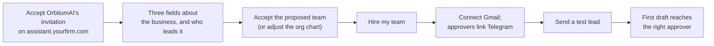
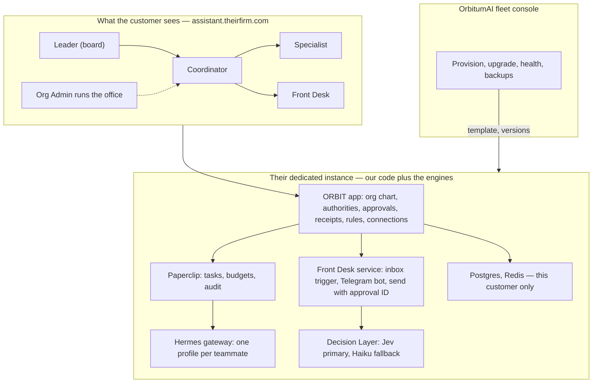
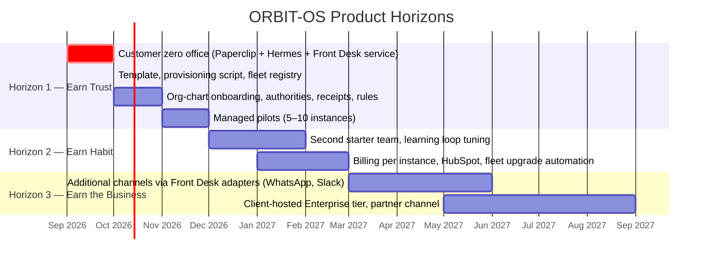

# ORBIT-OS — Product Vision

**Prepared for:** Shuv Chowdhury, Founder & CEO, OrbitumAI
**Prepared by:** Head of Product (AI Products)
**Date:** September 28, 2026
**Status:** v2.1 — two engines (Paperclip, Hermes) plus ORBIT's own Front Desk service and a Decision Layer (Jev primary, Claude Haiku fallback); OpenClaw removed; runtime choice reconfirmed. Dedicated instance per customer, human authority model, three-tier data commitment. Founder sign-off items in §11. Change log in §15.

---

## 1. Executive Summary

ORBIT-OS should not be sold as "an AI agent orchestration platform." Nobody who runs a 12-person plumbing company, a boutique law practice, or a regional staffing firm wakes up wanting orchestration. They wake up wanting the follow-up email to already be sent, the expense to already be approved, and the lead to already be sorted.

**The vision:** *ORBIT-OS is the first employee an SMB hires that never needs onboarding.* A business gets a small AI office: a Coordinator who organizes, Specialists who make judgment calls, and a Front Desk that talks to the outside world. The business's leaders are the board. You describe the job in plain English. The office does the job, asks before anything that matters, and shows you exactly what it did and what it cost.

**What v1.3 settles** (detail and sign-off status in §11):

1. **Every customer gets a dedicated ORBIT-OS instance**, on its own host and its own domain (`assistant.theirfirm.com`), provisioned and operated by OrbitumAI. The shared multi-tenant platform in v1.1–1.2 is retired. Isolation is physical, not a filter.
2. **The office model replaces the workflow model.** Customers hire teammates from an org chart, not build automations on a canvas. Paperclip runs the office; Hermes powers the thinkers; the Front Desk is ORBIT's own deterministic service. There is no third agent runtime.
3. **Access is separate from authority.** The person who sets up the app (often an office manager) is not assumed to lead the business. Leaders approve pricing, commitments, rules, and cost increases; approvers handle routine replies; every outbound message needs approval from someone who holds authority for its category.
4. **Customers never see internal names.** No tiers, engines, cores, modules, or upstream project names in the product, landing page, emails, or errors.
5. **Managed setup before self-serve.** OrbitumAI provisions each instance and runs a weekly call with every early customer. Public self-signup does not exist.
6. **Customer zero is OrbitumAI.** The inbound-lead office runs on our own leads before any external customer.

---

## 2. Vision Statement

> **Every small business deserves a chief of staff. ORBIT-OS is that chief of staff — one that reads, decides, acts, and reports back, and that a business owner can trust with real work.**

**Ten-year horizon:** ORBIT-OS becomes the operating layer for SMB work — the thing a business runs *on*, the way it runs on a phone and a bank account. Jobs are described, not built, and the office improves because the business uses it.

**Eighteen-month horizon (the part we can control):** 300 paying businesses, each running an office they would be upset to lose, with a Net Promoter Score above 50 and monthly churn under 2%. (Reduced from 1,000 in v1.2: dedicated instances and managed setup trade breadth for depth and trust in the first eighteen months.)

---

## 3. Why Now, and Why Us

| Signal | What it means for ORBIT-OS |
|---|---|
| Frontier models can now reliably *decide*, not just generate | The Specialist role is buildable on commodity APIs |
| Zapier-class tools automate *steps*; they do not automate *judgment* | The gap is "if this, then think, then ask, then do" — that is our whole product |
| SMB owners have tried ChatGPT and are disappointed it doesn't *do* anything | Demand is warm; the objection is "will it act, and can I trust it?" |
| Open-source agent infrastructure exists (Paperclip for governing agents, Hermes for reasoning and memory) | We assemble and productize behind our own app; we do not invent the primitives, and we do not let them own customer trust |
| Agent tools are built for one technical operator, not for a business with several people | The org-chart, authority, and instance model is the product gap, not the model quality |

**Why OrbitumAI:** 25 years of enterprise program management across 51 countries means the founder has seen every way an automation project fails — bad handoffs, no ownership, no audit trail. That is precisely the taste this product needs. The active ADP SMB sales role gives a live, warm channel to the exact buyer.

---

## 4. Who We Are Building For

**Target segment:** professional services firms with 10–50 employees — bookkeeping and accounting, law practices, staffing agencies, insurance brokers, consultancies. Sold to the owner or a department head; run day to day by one person as Org Admin.

**Primary persona — "Maria, the office manager (Org Admin)"**
Runs the office at a 12-person bookkeeping firm. Not technical. Sets up ORBIT-OS, connects the inbox, approves routine replies from her phone, keeps the team and budget in order.

**Persona — "David, the CEO (Leader)"**
Rarely opens the dashboard. Approves anything with a price on it from Telegram, reads the weekly review by email, signs off on new rules and budget increases. Nobody can remove his authority without him.

**Persona — "Jordan, staff (User)"**
Wants to know which leads came in and what was sent, so nothing is promised twice.

**Customer zero:** OrbitumAI itself, where the founder holds every role at once.

**Not our customer (now):** developers, agencies building for clients, enterprises with procurement, and anyone who wants to run the underlying tools themselves.

---

## 5. The Experience Promise

Five promises, in priority order:

1. **Describe, don't configure.** Onboarding proposes an AI team from three fields about the business. The owner accepts it in one click or adjusts an org chart. Ten minutes to a hired team.
2. **Show the work.** Every action has a receipt — what was decided, why, who approved it, what it cost.
3. **Ask the right person before it matters.** Routine replies go to the approver; pricing and commitments go to the Leader; backups cover absences. Nothing is sent without a tap from someone with authority.
4. **No surprise bills.** A budget per teammate, hard stops, and a plain-English cost line on every task. An idle office costs nothing.
5. **It gets better because you used it.** Approvers' edits become proposed rules; a Leader approves them; the office follows them from the next task.

### The first ten minutes (target flow)

If any step requires the user to understand the words *tier*, *engine*, *adapter*, *heartbeat*, *token*, or *webhook*, we have failed.

---

## 6. Product Principles (the tie-breakers)

| # | Principle | What it rules out |
|---|---|---|
| 1 | **The user's time is the product.** Measure hours given back per customer per week; ship what moves it. | Feature breadth for its own sake |
| 2 | **Opinionated defaults, escapable expertise.** One right way to start; power features behind "Advanced." | Exposing models, temperature, or turn caps to an owner |
| 3 | **Trust is earned per action, not per account.** Every consequential action is explainable and approved by someone with authority. | Silent automation; "it just ran" |
| 4 | **One name, one story.** Customers see ORBIT-OS and their teammates. They never see Paperclip or Hermes. | Marketing copy that reads like an architecture doc |
| 5 | **Depth before breadth.** Gmail, Telegram, and one CRM that work flawlessly beat 100 integrations that mostly do. | "100+ integrations" as a launch claim |
| 6 | **Cost is a first-class UI element.** If the user can't see the price of a decision, we haven't finished designing it. | Hidden model spend |
| 7 | **Isolation is physical.** One instance per customer. Nothing is fixed by hand on one instance; the template is fixed and re-applied. | Shared databases, shared gateways, manual patches |

---

## 7. What the Product Is (and Isn't)

### The AI office, and what powers it

| What the customer sees | Internal name only | Job |
|---|---|---|
| **Coordinator** (e.g. "Orbi, Chief of Staff") | Hermes Agent | Organizes, handles unclear items, writes the weekly review, proposes rules and hires |
| **Specialist** (e.g. "Scout, Lead Analyst") | Hermes Agent | Researches, scores, drafts, explains why; learns from approved rules |
| **Front Desk** (e.g. "Relay") | ORBIT Front Desk service (our code, not an agent) | Watches the inbox, filters, opens tasks, delivers drafts to the right approver, sends only approved text |
| Fast decisions behind the scenes: is this a lead, how risky is this draft, which model should handle it | ORBIT Decision Layer (Jev, with Claude Haiku fallback) | Returns typed answers with probabilities; a signal only, never drafts text and never authorizes a send |
| The office itself: tasks, budgets, audit | Paperclip | Wakes teammates on events, enforces budgets, keeps the task record |
| The app: org chart, approvals, receipts, rules, connections | ORBIT (our code) | The customer's system of record |

**Lanes are enforced by configuration, not prompts.** Only the Front Desk has send tools. Specialists have no outbound channels. An email cannot trick a Specialist into sending, because it cannot send.

### The dedicated-instance model

ORBIT-OS is deployed as one complete instance per customer — its own app, database, Paperclip, and Hermes gateway on its own host under the customer's domain — provisioned and operated by OrbitumAI. This is a day-one decision for four reasons:

- **The customer can't host anything.** A 20-person firm has no server and no IT. "Their own environment" means their own instance and domain, run by us.
- **Isolation stops being code.** No row-level security to get wrong, no shared gateways, no cross-tenant tests. Customer A's problem never touches customer B.
- **It is faster to start.** Customer zero already *is* one instance. Customer one is that instance again with a different name, domain, and Gmail account.
- **It answers procurement later.** "Your data never leaves your instance" is the sentence enterprise buyers want, and Google Workspace customers can use an internal OAuth app in their own Google project, avoiding Google's verification and security assessment.

**What we commit to:** one template in Git; a provisioning script that takes a name and a domain; an instance registry; a monthly upgrade day with staging first and per-instance rollback; nightly backups per instance; a rule that nothing is ever fixed by hand on one instance.

**What we commit to with data:** each instance keeps an append-only event log as the source of truth for receipts, audit and exports; only numbers leave an instance for OrbitumAI's fleet metrics; training data leaves only after redaction inside the instance and with the customer's consent, and can be deleted per customer. No data lake: the fleet's volumes fit Postgres for years, and a lake would contradict "your data never leaves your instance." Revisit only at hundreds of instances, with a dedicated data person, or when an enterprise customer wants events exported to their own warehouse.

**What we defer:** client-hosted instances in the customer's own cloud (Enterprise tier, with a contract, when procurement asks) and a shared multi-tenant platform (only if the fleet ever outgrows scripted operations; the schema keeps `workspace_id` so that door stays open).

### Human authority

Access roles (User, Org Admin, Super Admin) decide what someone can configure. Authorities (Leader, Approver, Backup approver, Budget holder) decide what they can approve. Any member can hold any authority. Board-level messages — price, terms, payment, commitments, several recipients — go only to Leaders. Granting or removing Leader authority requires an existing Leader to confirm. OrbitumAI never holds authority inside a customer's instance.

### The customer-facing surface (MVP)

| Surface | Purpose |
|---|---|
| **Team** | The org chart: who does what, what each teammate will never do, budgets |
| **Waiting for you** | Drafts and requests routed to the person's authority, on Telegram and in the app |
| **Tasks and Receipts** | Every task's story; every sent message with what, why, who approved, cost |
| **Reviews and Rules** | The weekly review and the rules the office follows |
| **Connections** | Gmail, Telegram, one CRM (HubSpot). That's the MVP list |

### Explicitly not in the MVP

- Public self-signup, workspace switching, or any shared platform surface
- Drag-and-drop workflow canvas, template marketplace, public API, SDK, white-label
- WhatsApp, Slack delivery, voice, browser automation (Horizon 3; each is an adapter added to the Front Desk service; any runtime for them is evaluated then)
- iMessage (no viable hosted path)
- Marketing claims the MVP cannot back: 100+ integrations, 20+ templates, model-choice messaging

### Landing page status

The public landing page is built (Next.js). Before public promotion it needs the copy-alignment pass from v1.2 (remove tiers and component names, "How it works" becomes *Describe → Approve → Done*, fix the low-contrast CTA band) plus two v1.3 changes: replace "Sign up" with "Request your office," and add the line "Your own instance, your own domain, run for you."

---

## 8. The Launch Office

One starter team, done completely, before any other:

| Teammate | Trigger | Decides | Does | Approval default |
|---|---|---|---|---|
| **Front Desk** | New inbound email | Lead or not (rules first, small model second) | Opens a task; delivers drafts; sends approved text | Never sends without an approval ID |
| **Specialist, Lead Analyst** | Task assigned | Fit score, action, draft, and the flags that set the approval category | Posts a structured draft | Routine → approver; pricing or commitments → Leader |
| **Coordinator** | Unclear items; Friday routine | What stalled; one recommendation | Weekly review; proposed rules and hires | Rules and cost increases need a Leader |

Second starter team (customer support office) follows in Phase 2, driven by what pilots ask for.

---

## 9. Success Measures

| Horizon | North-star | Supporting metrics |
|---|---|---|
| **Customer zero (Oct 2026)** | One real lead from inbox to approved reply in under 15 minutes, every day for two weeks | Cost per lead measured · zero sends without an approval record · zero idle model calls |
| **Pilots (Nov–Dec 2026)** | 50% of invited Org Admins complete a live run within 24 h | Provisioning under 15 min · time-to-first-run under 10 min · 5–10 instances · NPS > 40 · edit rate falling week over week |
| **Phase 2 (Q1 2027)** | Median customer runs the office daily | 25% pilot→paid · $10K MRR · churn < 3% · one upgrade day a month with zero rollbacks |
| **Phase 3 (Q2–Q3 2027)** | 10 hours/week given back per customer | 300 paid · $60K MRR · churn < 2% · NPS > 50 |

**The one metric on the wall:** *Hours given back per customer per week.*

---

## 10. Roadmap Horizons

**Horizon 1 — Earn trust (now → Dec 2026).** Customer zero first. Then the template and provisioning script, so customer one is a script run. Org-chart onboarding, authorities, receipts, rules. Five to ten managed pilots from the ADP and consulting network, each with a weekly 20-minute call.

**Horizon 2 — Earn habit (Jan → Mar 2027).** A second office, the learning loop proven by falling edit rates, billing per instance, and upgrade day fully automated.

**Horizon 3 — Earn the business (Apr → Sep 2027).** Channels beyond email as customers need them. Enterprise tier for client-hosted instances when a procurement team asks with a contract.

---

## 11. Decisions — Status and Founder Sign-off

| # | Decision | Position | Status | Sign-off |
|---|---|---|---|---|
| 1 | Customer-facing naming | No internal names anywhere; "How it works" is *Describe → Approve → Done* | Adopted | ☐ |
| 2 | Product model | AI office with org-chart-first onboarding replaces workflow templates and canvas | Adopted | ☐ |
| 3 | Assistant names | Teammates are named per office (working names Orbi, Scout, Relay); "Jarvis" retired | Adopted | ☐ |
| 4 | Approval policy | Every outbound message approved by a member with authority for its category; board-level only by Leaders | Adopted | ☐ |
| 5 | Pricing frame | Per AI teammate plus included AI budget, unlimited human viewers: $99 / $199 / $499; managed setup fee for early customers | Open | ☐ |
| 6 | Deployment model | **Dedicated instance per customer, provisioned and run by OrbitumAI, on the customer's domain.** Replaces shared multi-tenancy | Adopted | ☐ |
| 7 | Engine stack | Paperclip + Hermes in every instance; the Front Desk is ORBIT's own service; OpenClaw is not used (evaluated and declined: personal-operator defaults, duplicate capability with Hermes, undocumented link into Paperclip, public endpoint for Gmail push) | Adopted | ☐ |
| 8 | Access vs authority | Separate access roles and authorities; the person who sets up is not assumed to lead | Adopted | ☐ |
| 9 | Go-to-market | Managed setup and weekly calls for the first 5–10 customers; no public self-signup | Adopted | ☐ |
| 10 | Landing page palette | Keep the built orange, or move to the violet/fuchsia spec | Open | ☐ |
| 11 | Google OAuth path | Per-customer internal Google app where the customer is on Google Workspace; IMAP as the fallback trigger; confirm verification cost for a shared app | Open | ☐ |
| 13 | Decision Layer | Jev (TypeSafe AI) as primary typed-decision model for lead filtering, approval-category gates and model routing, behind one interface with a Claude Haiku fallback; Claude Sonnet 5 stays the reasoning and drafting model in Hermes. Jev may raise a category, never lower it, and never authorizes a send | Adopted | ☐ |
| 14 | Agent runtime | Paperclip + Hermes reconfirmed on Sept 28, 2026 after weighing Mastra; upstream risk handled by pinned versions, adapters and an ORBIT-owned Postgres record | Adopted | ☐ |
| 15 | Approval channel | Telegram is still specified in this document, but the founder does not want Telegram in ORBIT-OS; replacement (in-app, email links or both) to be chosen before Front Desk build | Open | ☐ |
| 12 | Data architecture | Three tiers: instance event log, numbers-only fleet metrics, consented redacted training corpus; monthly partitions; written retention policy; no data lake | Adopted | ☐ |

---

## 12. Risks We Are Choosing to Accept

| Risk | Mitigation |
|---|---|
| A wrong automated action damages a customer relationship | Approval by authority on every send; receipts; review mode default for week one |
| Model costs exceed assumptions | Budget per teammate with hard stop; event-driven wakes; measured cost per lead from week 3 |
| Solo founder-developer bandwidth | Customer zero first; managed setup; everything scripted before customer three; weekly calls are the founder's main job |
| Two fast-moving open-source projects | Pinned versions, staging, one upgrade day a month, rollback per instance; a Front Desk that is plain code |
| Fleet grows faster than automation | Cap new instances per month to what one upgrade day can absorb; provisioning and upgrades scripted before customer three |
| Instance drift after manual fixes | Template-only changes; posture check after every upgrade flags drift |
| Leaders who never join or never respond | Board-level drafts are held and never sent; reminders; delegation; interim-Leader rule to decide |
| Google's Gmail verification cost or timeline | Internal OAuth app per Workspace customer; IMAP fallback; test users only until a shared app is verified |
| Jev is new (early access since Sept 15, 2026), text-only with a 32K context, and can be steered by injected text in an email | Deterministic filters before and category checks after every Jev call; Haiku fallback behind the same interface; decision quality measured on customer zero via `decision_calls` human verdicts; confirm the provider (TypeSafe direct or AI/ML API) and never mix credentials |
| Upstream components change under us | ORBIT owns the record; engines sit behind adapters and can be replaced one at a time |
| Fleet-wide questions become unanswerable with one database per customer | Nightly numbers-only rollups to the fleet console; event log inside each instance as the single source every view derives from |
| Training data use damages trust | Opt-in consent per customer, redaction inside the instance, deletable per customer, audited on the instance |

---

## 13. Launch Readiness Checklist (Horizon 1)

- [ ] Customer zero: one real lead from inbox to approved reply, daily, for two weeks; cost per lead recorded
- [ ] Provisioning: a second instance created from the script in under 15 minutes with no manual steps
- [ ] First-run flow completes in under 10 minutes for 5 pilot Org Admins
- [ ] Every sent message has an approval record with decider, authority used, and timestamp; zero sends without one
- [ ] Board-level drafts reach only Leaders; an Org Admin cannot grant themselves board-level approval
- [ ] Budget hard-stop tested per teammate; idle instance makes zero model calls
- [ ] Zero internal component names in UI, landing page, emails, or errors
- [ ] No engine reachable from the public internet on any instance; posture check passes fleet-wide
- [ ] One upgrade-day rehearsal across staging and two instances, including a rollback
- [ ] Nightly backups on every instance; one restore drill completed
- [ ] 5–10 pilot businesses recruited with a weekly 20-minute call scheduled for each
- [ ] Pricing page speaks in teammates and outcomes, not tasks and tokens
- [ ] Every receipt and audit entry derives from the event log; nightly rollups arrive from every instance with no customer content; retention job runs and drops expired partitions

---

## 14. Closing Note to the Founder

The engineering foundation you've documented is stronger than most seed-stage companies have. The risk isn't that the system won't work — it's that the product will feel like the system. Give each business its own office, on its own domain, run for them, and let Maria meet a colleague, not a platform.

---

## 15. Change Log

| Version | Date | Changes |
|---|---|---|
| 1.0 | Sept 2026 | Initial vision, principles, MVP scope, templates, roadmap |
| 1.1 | Sept 2026 | Multi-tenant foundation added |
| 1.2 | Sept 15, 2026 | Agent stack confirmed behind the ORBIT Control Plane; hub topology; verify-before-build audit; isolation rules; landing page status; §11 sign-off table |
| 2.1 | Sept 28, 2026 | Decision Layer added (Jev primary, Haiku fallback); decisions 13 to 15; Jev risk row; Paperclip + Hermes reconfirmed; Telegram conflict flagged as open |
| 2.0 | Sept 16, 2026 | OpenClaw removed; Front Desk is ORBIT's own service; decision 7 closed; risks and roadmap updated |
| 1.4 | Sept 16, 2026 | Three-tier data commitment (instance event log, fleet metrics, consented training corpus), retention policy, explicit no-data-lake position; decision 12; two risks; one checklist item |
| 1.3 | Sept 16, 2026 | Dedicated instance per customer replaces multi-tenancy; AI-office model (Coordinator, Specialist, Front Desk) replaces workflow templates; access separated from authority; managed setup replaces self-signup; Front Desk as ORBIT code at launch with OpenClaw per instance on demand; target segment narrowed to 10–50 employee services firms; horizons and metrics re-based; new risks and checklist items |

---

*OrbitumAI · McKinney, TX · shuv@orbitumai.com*
