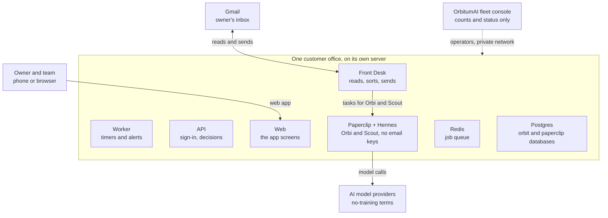
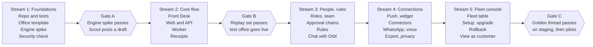

# ORBIT-OS PRD v7.0 - One Release, All Features

Oct 2, 2026 · Prepared by OrbitumAI · Product Owner: Shuv Chowdhury

## Executive summary

ORBIT-OS v7.0 puts every feature from PRD v6.2, its Phase 2 and Phase 3 lists, and the new ideas from the product review into one release, for three kinds of person: the User, the Org Admin and the Super Admin.

**What Orbitcrew does, in plain words.** A small firm gets an email from a possible customer. Within two minutes the sender gets a short "we got your message" reply. Meanwhile an AI teammate named Scout reads about the sender, writes a full reply in the owner's voice, and waits on the owner's phone. One tap sends it. Every message has a receipt that shows what was sent, why, who approved it, when and what it cost. A second AI teammate, Orbi, handles unclear emails and writes a weekly review.

**Who uses it.**

- **User:** answers leads, approves replies and reads receipts.
- **Org Admin:** sets up the office, the people, the rules and the spending limits.
- **Super Admin:** OrbitumAI staff who run every customer's office behind the scenes.

**Why this version exists.** You asked for everything in one phase. This document does that: it has no "Phase 2" list. Every feature has an ID, an owner role and a place in the build plan.

**Honest scope warning.** v6.2 was written in scope-reduction mode on purpose. It cut people management, the fleet console, push alerts, extra connectors and more, so a solo builder could prove one thing in four weeks: that owners will tap Send. Putting everything back into one release means:

- The first customer cannot go live until far more is built.
- The "prove it first" evidence (customer zero) now has to be gathered with an unfinished product, or after the whole release.
- Two items depend on outside parties: WhatsApp needs Meta approval, and customers outside Google Workspace need a Google review or an email-protocol path.

Section 13 keeps one release but orders the work into build streams with internal checkpoints, so you can still test early. Section 14 lists the decisions I need from you.

**Checklist for this document**

- [ ] Read section 2 and confirm what stays out of scope.
- [ ] Answer the open decisions in section 14.
- [ ] Approve the build order in section 13.

## What changed from v6.2

v7.0 removes the phase labels: all Phase 2 and Phase 3 features from v6.2 move into the single release, and the new ideas from the product review are added.

| Area | v6.2 | v7.0 |
| --- | --- | --- |
| People | One owner holds every role | Many people, four roles, org chart, backups, delegation |
| Screens | 6 screens, no navigation bar | Full app with navigation: Home, Team, Tasks, Reviews, Rules, Settings |
| Alerts | Email notices only | Email plus phone push and lock-screen actions |
| Connections | Gmail and Resend only | Adds HubSpot, Slack, Calendar, Drive, Stripe, Notion, WhatsApp |
| Chat | None | Chat with Orbi by text and voice |
| AI team | Fixed: Orbi and Scout | Hire more teammates from inside the app |
| Learning | Record edits only | Rule proposals, quality checks, optional training data with consent |
| Operator tools | Scripts and a registry file | Fleet console with support view, cost and profit views |
| Billing | Set by OrbitumAI | Customers manage plan and invoices |
| Sign-in | Email link only | Adds passwords, authenticator codes and Face ID |

**Stays out of scope** (declined in v6.2, and you did not ask to bring them back):

- Public self-signup
- One shared platform for all customers
- Template marketplace
- Public API and SDK
- White-label
- Telegram, Google sign-in and passkeys
- Resend for any lead-facing mail

**Kept as is from v6.2:** one dedicated server per customer, the approval rules, Paperclip and Hermes as the AI engine, the two-minute acknowledgment target, and every safety rule in the Front Desk.

## Goals, non-goals and success metrics

The release succeeds when owners answer leads faster without losing control, and OrbitumAI can run many offices without fixing any by hand.

**Goals**

- Every real lead gets a "we got your message" reply within 2 minutes (target: 95% of leads).
- The owner gets a researched draft within 15 minutes (target: 90% of leads).
- No full reply is ever sent without a recorded approval from a person with the right authority.
- Several people can share an office with clear roles, backups and escalation.
- An idle office makes no AI calls, except Orbi's Friday review.
- Setup, upgrade, backup, restore and shutdown are scripted or one-click. Nothing is fixed by hand on one office.
- Every customer can see time saved, edit rate and cost per lead.

**Non-goals**

- Anything in the "stays out of scope" list in section 2.
- A shared platform where customers' data sits together.

**Success metrics**

| Stage | Measure | Target |
| --- | --- | --- |
| Test office (founder inbox) | Leads acknowledged within 2 minutes | 95% or better |
| Test office | Median time from lead arriving to owner tap | Under 30 minutes |
| Test office | Drafts sent, not discarded | 80% or better |
| Test office | Drafts sent without edits | 50% or better |
| Test office | Full replies sent without a tap | 0 |
| Test office | Acks sent to non-leads, known contacts or auto-senders | 0 |
| First named firm, 4 weeks | Runs on its own server at an agreed price | Yes |
| First named firm | Owner says they would be upset to lose it | Yes |
| Pilots | New office set up with no manual steps | Under 15 minutes |
| Pilots | Teams with 2 or more people using approvals | 50% within 30 days |
| Pilots | Owners who complete a live run within 24 hours | 50% |
| Pilots | Sends without an approval record | 0 |
| Pilots | Edit rate over 4 weeks | Falling |
| Pilots | NPS | Above 40 |
| Fleet | Unplanned upgrade rollbacks | 0 |
| Fleet | Operator time per office | Tracked monthly; add help at 25 offices or 10 hours a week for 4 weeks |

If the test office misses a target, the v6.2 fixes still apply: faster approval path for slow taps, better drafting for low unedited rate, polling fixes for slow acks, and an immediate switch-off after any zero-tolerance breach.

## Users, roles and the AI team

Three kinds of person use the product, and four roles decide who may approve what inside one customer's office.

| Who | What they do | Where they work |
| --- | --- | --- |
| User | Answers leads, approves replies, reads receipts | The customer app on phone or desktop |
| Org Admin | Sets up the office, people, rules and limits | Settings, Team, Rules in the same app |
| Super Admin | Runs every customer's office (OrbitumAI staff only) | The fleet console, over a private network |

**Roles inside an office.** A person can hold more than one. The owner holds all of them at the start.

| Role | Plain meaning |
| --- | --- |
| Org Admin | Runs the office: people, rules, connections, billing |
| Leader | Approves the big replies (prices, fees, contracts, any promise) |
| Approver | Approves everyday replies and polite declines |
| Budget holder | Approves higher spending limits |

The Super Admin never holds any role inside a customer's office. When a Super Admin helps with support, it is a logged "view as customer" session that the owner has allowed.

**AI teammates.** They are not people and cannot approve anything.

- **Orbi, the Coordinator:** decides whether an unclear email is a lead, takes over stuck drafts, runs the Friday review, and answers the owner in chat.
- **Scout, the Specialist:** researches each lead and writes the draft reply.
- **More teammates:** an Org Admin can hire extra teammates from a short list of ready-made roles (for example a follow-up writer). Each one gets its own budget, turn limit and list of allowed actions.

The Front Desk (inbox reading, the first reply, sending) is ordinary software, not an AI teammate.

## Deployment model and architecture

Every customer gets a complete, separate office on its own small server, and only the Front Desk can send email.

Read the picture top down: the owner's team uses the web app, the Front Desk talks to Gmail and hands tasks to Orbi and Scout, and the AI engine can only reach the AI providers, never the inbox.

- **One office per customer:** web, API, worker, Front Desk, Redis, Paperclip, Hermes and one Postgres server with two databases (orbit and paperclip) and separate logins. Nothing is shared with other customers.
- **Own address:** each office lives on `assistant.<customer-domain>` through a CNAME the customer adds. Security certificates are automatic.
- **Same recipe every time:** offices are built from one versioned template. Only settings and secrets differ.
- **OrbitumAI operates it:** customers never touch servers, containers or engine screens. Engine screens are reachable only over OrbitumAI's private network.
- **Pending work lives in the database:** Redis only runs jobs. A check every minute re-queues anything Redis lost.
- **Client-hosted offices:** the same template can run on a customer's own server under a contract (Enterprise tier). It is not offered at launch.

## User features

The User can answer any lead in under a minute from a phone, and always knows what was sent in their name. Source column: **v6.2** = already specified, **v6.2 P2/P3** = was deferred and now ships, **New** = added by the product review.

**Getting in**

| ID | Feature | In plain words | Source |
| --- | --- | --- | --- |
| U-01 | Email sign-in link | No password. A link in your email signs you in; it works once and expires in 15 minutes. | v6.2 |
| U-02 | 30-day session | You stay signed in for 30 days. Risky actions (price, fee, contract) ask for a fresh sign-in if it has been over a day. | v6.2 |
| U-03 | Password and authenticator code | Optional password plus a code from an authenticator app, for people who prefer it. | v6.2 P2 |
| U-04 | Face ID or Touch ID | Confirm a send with your face or fingerprint. | New |

**Handling replies**

| ID | Feature | In plain words | Source |
| --- | --- | --- | --- |
| U-10 | Waiting for you | A list of drafts that need you, oldest first, each with a countdown to when it expires (72 hours). | v6.2 |
| U-11 | Confirm page | Read the lead's message and the draft. Nothing happens until you press a button. | v6.2 |
| U-12 | Edit in place | Change the draft right on the page. Both versions are saved on the receipt. | v6.2 |
| U-13 | Send, Discard, reason | Send the reply in the original email thread, or discard it and say why (not a lead, I'll reply myself, draft was wrong). | v6.2 |
| U-14 | Six safe states | Clear screens for: expired, already decided, thread changed, sending or failed, office paused, not yours. | v6.2 |
| U-15 | Resolve page | For leads that got an acknowledgment but no full reply: Reply now, Replied elsewhere, or No reply needed. | v6.2 |
| U-16 | Snooze | Hide a draft until a time you pick. The 72-hour clock keeps running. | New |
| U-17 | Tone buttons | One tap to make the draft shorter, warmer or more formal. | New |
| U-18 | Why this draft? | Shows what Scout used: the lead's message, your writing samples, your facts file. | New |
| U-19 | Voice edits | Dictate changes instead of typing. | New |
| U-20 | Undo send | A 30-second window to stop a reply before it goes out. | New |
| U-21 | Ask the leader | If a draft is above your level, one tap sends it to a Leader with a note. | v6.2 P2 |

**Staying informed**

| ID | Feature | In plain words | Source |
| --- | --- | --- | --- |
| U-30 | Home | Waiting for you, today in one line (with time to reply), recent receipts, and last week's review. | v6.2 |
| U-31 | Receipts | One per sent message: who it went to, draft and final text side by side, reason, who approved, times, cost. | v6.2 |
| U-32 | Email alerts | A short email when a reply is waiting. It never contains the lead's name or message. | v6.2 |
| U-33 | Phone push alerts | The same alerts as notifications on your phone. | v6.2 P2 |
| U-34 | Lock-screen actions | Open, send or snooze from the notification. A Home Screen widget shows the waiting count. | New |
| U-35 | Lead history | One page per lead with every email, reply, receipt and note. | New |
| U-36 | Won or lost | Mark a lead as won or lost so the weekly review shows what replies earned. | New |
| U-37 | Tasks | Follow-ups Orbi or you create, with a due date and an owner. | v6.2 P2 |
| U-38 | Reviews | A screen of every weekly review, not only the newest. | v6.2 P2 |

**Working with Orbi and others**

| ID | Feature | In plain words | Source |
| --- | --- | --- | --- |
| U-40 | Chat with Orbi | Ask in plain words: "show today's leads", "what is waiting?" Text first, then voice. | v6.2 P2/P3 |
| U-41 | I'm away | Hand your approvals to someone you choose for a set time. | New |
| U-42 | Delegation | Give another person your approval power for a while, with an end date and a log. | v6.2 P2 |
| U-43 | Light and dark mode | Follows the phone setting. | v6.2 |

## Org Admin features

The Org Admin can set up, shape and safely run the whole office without asking OrbitumAI for help, except for server-level work. Same source labels as the User section.

**Setup and voice**

| ID | Feature | In plain words | Source |
| --- | --- | --- | --- |
| A-01 | Standing acknowledgment approval | You approve the short "we got your message" template once. Any wording change needs your approval again. | v6.2 |
| A-02 | Two template versions | One with the lead's first name, one without. Only two fill-in fields are allowed, so no AI text ever goes into it. | v6.2 |
| A-03 | Website and booking link | Set at setup, correctable any time. | v6.2 |
| A-04 | Writing samples | Review the 20 sent emails Scout learns your voice from, and swap them. | v6.2 |
| A-05 | Facts we can state | A file of things Scout may say about the firm. Anything not in it is left out. | v6.2 |
| A-06 | Setup checklist | A guided list with a progress bar until the office is fully live. | New |
| A-07 | Practice mode | A pretend lead runs the whole flow, so you can see it before going live. | New |
| A-08 | Business and quiet hours | Choose when alerts may reach you and when replies may go out. | New |
| A-09 | VIP and never-reply lists | VIPs are always handled by you. The never-reply list is skipped. | New |
| A-10 | Guided onboarding | A short walkthrough that sets up everything above in order. | v6.2 P2 |

**Control and safety**

| ID | Feature | In plain words | Source |
| --- | --- | --- | --- |
| A-20 | Pause auto-reply | One switch stops the "we got your message" replies. | v6.2 |
| A-21 | Pause the whole office | One switch stops acknowledgments, drafts and sends together. | New |
| A-22 | Rules | Simple rules such as "any mention of a price needs a Leader." Rules can only add caution, never remove it. | v6.2 P2 |
| A-23 | Rule suggestions | The system proposes a rule after repeated edits; you accept or reject it. | v6.2 P2 |
| A-24 | Office-changes approval | Changes to rules, costly hires and budget raises need a named approver. | v6.2 P2 |
| A-25 | Reconnect your inbox | If Google signs you out, the office pauses and a button reconnects it. | New |
| A-26 | Activity log | A readable list of who approved what, using which authority. | v6.2 |

**Spending**

| ID | Feature | In plain words | Source |
| --- | --- | --- | --- |
| A-30 | Spending view | Spend against limit for the company, each AI teammate and daily lead screening. | v6.2 |
| A-31 | Budget warnings | A warning at 80% and a pause at 100%, per teammate. | v6.2 |
| A-32 | Change limits | Raise or lower limits yourself; raising needs the Budget holder. | New |
| A-33 | Plan and invoices | See your plan, upgrade it, download invoices. | v6.2 P2 |

**People and structure**

| ID | Feature | In plain words | Source |
| --- | --- | --- | --- |
| A-40 | Team screen | A list or org chart of people and AI teammates, with who reports to whom. | v6.2 P2 |
| A-41 | Invite people | Send an invitation that works once and expires in 7 days. | v6.2 P2 |
| A-42 | Roles | Give each person Org Admin, Leader, Approver or Budget holder. Authority is checked at the moment of each decision. | v6.2 P2 |
| A-43 | Backups and escalation | Name a backup for each approver. If nobody answers, the draft moves up the chain (2 hours, 2 hours, then 24 hours). | v6.2 P2 |
| A-44 | Delegation | Approve a delegation request, with an end date. | v6.2 P2 |
| A-45 | Authority-change requests | A person asks for a bigger role; a named person approves it. | v6.2 P2 |
| A-46 | Pending Leader rule | If the Leader seat is empty, a stated fallback applies. | v6.2 P2 |
| A-47 | Org chart editor | Drag boxes to arrange the team. | v6.2 P2 |
| A-48 | Hire AI teammates | Add a ready-made teammate role, set its budget, tools and turn limit, and see it join the chart. | v6.2 P2 |
| A-49 | Second starter team | Pick a different starter team for another job. | v6.2 P2 |

**Connections and data**

| ID | Feature | In plain words | Source |
| --- | --- | --- | --- |
| A-50 | Connections belong to the business | Whoever connects Gmail, the connection stays when they leave. | v6.2 |
| A-51 | More connections | HubSpot, Slack, Calendar, Drive, Stripe, Notion, and WhatsApp. Each shows what it can read and do. | v6.2 P2/P3 |
| A-52 | Results page | Replies sent, time saved (an estimate), edit rate, cost per lead. | New |
| A-53 | Privacy page | Shows what the AI saw and where it went. | New |
| A-54 | Export and delete | Download all receipts and data as files, or delete the office, completed within 30 days. | v6.2 |
| A-55 | Optional training data | If you choose, share redacted examples to improve drafts. Off unless you agree. | v6.2 P2 |

## Super Admin features

The Super Admin can run every customer's office from one console and prove that no office leaks into another. The console shows counts and status only, never a customer's emails or drafts. Access is OrbitumAI staff over a private network, with two-step sign-in.

**Running the fleet**

| ID | Feature | In plain words | Source |
| --- | --- | --- | --- |
| S-01 | Set up a new office | Enter six facts (name, domain, plan, owner email, website, calendar link). The office is running in under 15 minutes with no manual steps. | v6.2 |
| S-02 | Setup tracker | Shows each new customer's step and where it is stuck. | New |
| S-03 | Upgrade | Maintenance notice, backup, apply, security check, test, then done or roll back within 10 minutes. | v6.2 |
| S-04 | One-click rollback | Return an office to the previous version if an upgrade goes wrong. | New |
| S-05 | Upgrade calendar | One upgrade day per month, with automatic notice to customers. | v6.2 and New |
| S-06 | Test office | A staging office tries every new version first. | v6.2 |
| S-07 | Backup and restore | Nightly backups kept 30 days, restore to the same or a new server, a monthly practice restore. | v6.2 |
| S-08 | Pause, pause all | Pause one office or all of them. | v6.2 |
| S-09 | Shut down an office | Needs the customer's written request and the owner's confirmation. Export first, deletion after 30 days. | v6.2 |
| S-10 | Fleet console | The screen that replaces scripts: every office with health, versions, backups, team status, connections, incidents, drafts waiting over 24 hours, spend this month and operator minutes. | v6.2 P2 |

**Safety and trust**

| ID | Feature | In plain words | Source |
| --- | --- | --- | --- |
| S-20 | Security check | After every setup and upgrade: no public ports, engines hold no email keys, no risky tools, versions match. A failure blocks "healthy". | v6.2 |
| S-21 | Alerts | Emails when a server is down, a backup is missed or a send fails. | v6.2 |
| S-22 | AI provider outage warning | Flags offices affected when the AI provider is down. | New |
| S-23 | Operator audit | Every operator action is logged inside the affected office, where the owner can read it. | v6.2 |
| S-24 | Two-step sign-in for operators | Required for the console and the engine screens. | v6.2 P2 |
| S-25 | View as customer | A support view that the owner must allow, with a visible banner and a log. | v6.2 P2 and New |
| S-26 | Status page and incident log | A public status page and a private list of incidents. | New |
| S-27 | Evidence pack | A ready set of security and privacy proof for customers who ask. | New |

**Money and quality**

| ID | Feature | In plain words | Source |
| --- | --- | --- | --- |
| S-30 | Operator time tracking | Minutes per office each month. Add help at 25 offices or over 10 hours a week for 4 weeks. | v6.2 |
| S-31 | Cost analytics | Spend by office, teammate and AI model. | v6.2 P2 |
| S-32 | Profit per customer | What each customer pays against what they cost to run. | New |
| S-33 | Draft quality scoreboard | Share of drafts sent unedited, per office, trending over time. | New |
| S-34 | Skills review queue | Review any new skill an AI teammate proposes before it can be used. | v6.2 P2 |
| S-35 | Starter team templates | Manage the ready-made teams customers can hire from. | v6.2 P2 |
| S-36 | Overrides | Change a limit or setting for one office with a logged reason. | v6.2 P2 |
| S-37 | Settings panel | Per-office settings with a Test connection button for Paperclip, Hermes, the Front Desk, inbox and email. | v6.2 P2 |
| S-38 | Nightly numbers | Each office sends numbers only (emails, leads, acks, drafts, sends, cost, health) to the fleet database. | v6.2 |

## Front Desk and AI team requirements

The Front Desk reads the inbox, sends the first reply and sends approved replies; every v6.2 rule stays exactly as written, and v7.0 adds channels and tools on top.

**Reading and sorting email**

- **FD-1 Inbox reading:** checks Gmail every 30 seconds, skips mail already seen, strips signatures and quoted history, and drops receipts, newsletters, codes, password resets and bank notices before any AI sees them.
- **FD-2 Known contacts:** anyone who has emailed the owner, or been emailed by them, is a known contact and never gets an automatic acknowledgment.
- **FD-3 First message only:** an acknowledgment and a draft are handled for the first message of a thread. Later messages are left to the owner, with a "lead history" view (U-35) for context.
- **FD-4 Lead sorting:** one question per email (lead, not a lead, unsure) with a confidence score. Two failures send the email to Orbi and alert the owner.
- **FD-5 Hostile mail:** email text is treated as an attack. AI output never replaces the fixed rules and checks.

**The "we got your message" reply**

- **ACK-1 When it goes:** a lead with confidence 0.8 or higher, an unknown sender, the first message in a new thread.
- **ACK-2 Never when:** the mail has auto-sender or bulk headers, comes from a no-reply address, or was sent by the system.
- **ACK-3 Limits:** one per sender per 30 days, 10 per hour. The hourly limit pauses auto-reply and tells the owner.
- **ACK-4 Fixed text:** two approved versions with two fill-in fields. No AI text. No advice, prices or promises.
- **ACK-5 Works without the AI engine:** if Paperclip or Hermes is down, acknowledgments still go out.
- **ACK-6 Switch-on gate:** auto-reply stays off until the practice set of about 50 leads and 50 non-leads shows zero false positives.

**Drafting and the AI team**

- **AI-1 Scout drafts:** each lead becomes a task for Scout, who replies with a draft in a fixed format. A bad draft gets one correction request, then goes to Orbi and the daily digest.
- **AI-2 Orbi decides unclear leads:** a "lead" verdict goes to Scout with no acknowledgment. No answer in 10 minutes triggers one nudge, then a digest entry and an owner alert.
- **AI-3 Privacy by design:** AI memory is off, each lead gets its own session, and sessions are deleted at 90 days.
- **AI-4 Containment:** the AI engine runs in its own container with no email keys. Scout has no tools at launch. Research returns only once drafting is split from research.
- **AI-5 More teammates:** hired teammates (A-48) follow the same containment rules and get their own budgets.
- **AI-6 Chat:** Orbi answers questions in chat (U-40) using only data the signed-in person may see.

**Approving and sending**

- **SEND-1 Approval before sending:** the sender refuses any text without a valid approval ID. The only exception is the acknowledgment template under the standing approval.
- **SEND-2 In-thread:** replies go in the lead's original thread from the owner's own address.
- **SEND-3 One send:** states run issued, sending, then sent, failed or void, with a lock. A failed send is retried at most twice after checking the Sent folder.
- **SEND-4 Thread changed:** if the owner or the lead wrote again, the confirm page shows the change and asks again.
- **SEND-5 Undo window:** the sender waits 30 seconds after the tap before sending, so Undo (U-20) works.
- **SEND-6 Kill switch:** a wrongly sent acknowledgment switches auto-reply off at once. A full reply sent without a tap switches sending off.

**Daily digest.** Lists not-a-lead emails, Orbi's verdicts, leads not acknowledged and why, failed drafts, every acknowledgment (with a "Wrong, not a lead" button), unanswered drafts, and one spend line. Items that were acknowledged but never answered repeat daily and get flagged in the subject after 3 days.

**More channels.** Slack and WhatsApp arrive as new inbound adapters with their own approval courier, not a new runtime. WhatsApp requires Meta approval, which OrbitumAI does not control.

## Approvals, budgets and cost

No reply goes out without a recorded approval from a person with enough authority, and the AI can only make the rules stricter, never looser. This is the single place the approval rules are stated.

**Two kinds of approval**

- **Per-message approval:** issued for every full reply. It is tied to one message and one person's decision.
- **Standing template approval:** given once for the acknowledgment template only. Any wording change needs it again.

**Who approves what**

| Kind of reply | Who approves | If nobody answers |
| --- | --- | --- |
| Routine | Approver, or anyone above | Reminder at 2 hours, then the backup, then escalate |
| Decline or refer | Approver, or anyone above | Same |
| Board-level: price, fee, discount, contract terms, payment, more than one recipient, any commitment | Leader | Escalate up the chain; if still silent the draft is voided at 72 hours |
| Office change: new rule, costly hire, budget increase | Org Admin or Budget holder | Request stays open and is listed in the digest |

**Rules that never change**

- The category is the most sensitive of Scout's flags and the fixed checks (amounts, pricing words, contract words, recipient count).
- Authority is checked at the moment of decision and recorded with the decision.
- The first valid decision wins. A second attempt sees "already decided."
- The confirm link is signed, works once, is tied to one approval and expires with the draft. Opening it never acts.
- Board-level actions need a sign-in under 24 hours old.
- AI teammates can never approve.
- Paperclip board actions (hires, budget changes) run through ORBIT's service account only after the matching human decision is recorded.

**Budgets**

- Each AI teammate has its own monthly budget, a daily cap for lead screening, and a turn limit (Orbi 20, Scout 30).
- At 80% the owner is warned. At 100% that teammate pauses and nothing else does.
- If Scout is paused, drafts go to Orbi. If both are paused, leads go to the digest.
- An idle office makes no AI calls except Orbi's Friday review. There are no scheduled wake-ups.
- Scout may search the web at most 3 times per lead, once research is allowed (see AI-4).

**Cost records.** Every AI call is logged with model, tokens, cost, time and result. Receipts and spending screens read from that log.

**Pricing.** The office is priced as one unit. Before the first customer is quoted, a unit-economics sheet must show a positive margin per plan using the measured server size and AI cost. The price and setup fee are open decision 1.

## Data, security and compliance

Each customer's data stays on that customer's own server, and the only things that leave are anonymous numbers and calls to AI providers under no-training terms.

**Keeping customers apart**

- One server, one database set, one set of keys per customer. Nothing is shared.
- No database, queue or AI engine port is open to the internet. Operators reach engine screens only over a private network.
- The AI engine runs in its own container with no email keys and a read-only disk.
- Only the Front Desk can send email. A software test fails the build if any other program gains that power.

**People and sign-in**

- Sign-in options: email link (default), password with authenticator code, and Face ID or Touch ID on supported phones.
- Operators always use two-step sign-in.
- Every operator action, approval, template change, switch change and AI-engine board action is logged where the owner can read it.

**What the AI can see**

- Anthropic's no-training, zero-retention terms must be confirmed in writing before any named firm's email reaches an AI.
- Until then, only the founder's own inbox is processed by AI.
- Email bodies are cut and cleaned before any AI call. The size limit is open decision 6.
- The Privacy page (A-53) lists every AI call category and every connection that sees data.

**Keeping and deleting data**

| Data | Kept for |
| --- | --- |
| Raw email bodies and AI session files | 90 days |
| Redacted event and cost records | 24 months |
| Receipts | For the life of the customer |
| Backups | 30 days |

Expired data is removed automatically each night from settings, not from code. Customers can export everything and ask for deletion, completed within 30 days.

**Optional training data.** Off by default. If an owner agrees, redacted examples can be exported to improve drafts, and the owner can withdraw at any time.

**Secrets.** Connection tokens are encrypted with a per-office key and never reach prompts, logs, AI containers or the browser. A rotation runbook exists.

**Data that leaves an office.** Only (1) the nightly numbers rollup, (2) calls to AI providers, and (3) exports delivered to the customer. Nothing else.

## Non-functional requirements

The product must be fast on a phone, hard to break, and usable by everyone; these are the measurable limits.

| Area | Requirement |
| --- | --- |
| Acknowledgment speed | Within 2 minutes for 95% of real leads; internal budget of 90 seconds; independent of the AI engine |
| Draft speed | Notice within 15 minutes of the email arriving, 90% of the time |
| Polling | Gmail every 30 seconds; AI task every 15 seconds per open draft |
| Idle cost | No AI calls on an idle office except Orbi's Friday review |
| Setup time | Under 15 minutes with no manual steps |
| Availability | Per office. A server failure affects one customer. Recovery within 4 hours. |
| Server size | Roughly 2 to 4 GB of memory per office. Measured on the test office before the first pilot. |
| Upgrades | Monthly, staging first, automatic rollback within 10 minutes if the test thread fails |
| Backups | Nightly, both databases and AI volumes, 30 days, monthly practice restore, alert if missed |
| Isolation | No shared process, database, key or server between customers |
| Push and lock-screen | Alert delivered within 1 minute of the draft being ready |
| Undo window | Exactly 30 seconds before a reply leaves |
| Accessibility | Buttons at least 44 px (Send 48 px), text contrast at least 4.5 to 1, body text at least 16 px, keyboard use everywhere, works at 200% zoom, status changes announced. Automated check shows zero serious issues. |
| Design | Black and white with one red used only for errors; Inter font; plain lists, no card grids; light and dark follow the phone |
| Customer wording | Customer screens say Orbitcrew, Orbi and Scout. They never say ORBIT-OS, Paperclip, Hermes or tokens. |
| Quality gate | A fixed sample of past leads is re-run before any prompt or model change |

## Build plan for one release and risks

The release ships once, but the work runs in five streams with three checkpoints so the riskiest assumptions are tested first.

The first two streams and the first two checkpoints come straight from v6.2. Streams 3 to 5 are the added scope.

**What each checkpoint means**

- **Engine spike passes:** a Scout run posts a draft on a Paperclip task, a second task starts with an empty session, and the security check passes. v6.2 limits this to the end of build week 2; if it fails, the build stops and you decide.
- **Replay set passes:** about 50 real or written leads and 50 non-leads show zero false acknowledgments. Auto-reply cannot be switched on before this.
- **Golden thread passes:** on staging, a lead arrives, gets an acknowledgment, Scout drafts, the owner is notified, signs in, sends, the reply lands in the thread, and a receipt is written. Every upgrade must pass it too.

**Build checklist**

- [ ] Repo, tests and the office template
- [ ] Engine spike and security check
- [ ] Front Desk, web, API, worker, receipts
- [ ] Replay set and test office
- [ ] Roles, team, approval chains, rules, chat
- [ ] Push, connectors, WhatsApp, voice, export, privacy page
- [ ] Fleet console, setup tracker, rollback, view as customer
- [ ] Staging golden thread, then first named firm, then pilots

**Risks of putting everything in one release**

| Risk | Why it matters | Fallback |
| --- | --- | --- |
| Scope is far larger than the 8-week plan | One person cannot build 93 role features plus the engine in that time | Set the date after the spike; keep the test office checkpoint |
| No real-lead evidence until late | v6.2's four-week test was meant to prove owners tap Send | Run the founder inbox at checkpoint 2 and keep building behind it |
| Outside approvals | WhatsApp needs Meta approval; customers outside Google Workspace need a Google review or another path | Ship those behind switches as soon as approved |
| More ways to send in someone's name | Delegation, away mode, Slack and WhatsApp each add a path | Every path must pass the same approval-ID test in CI |
| AI engine upstream breaks | The gateway adapter is broken upstream and tracked in TODOS | Pinned versions, adapters only, own database record |
| Support load | More screens mean more questions | Setup tracker and the evidence pack come before pilots |

## Open decisions

Eleven decisions need your answer before the build starts; the first three change the schedule the most.

| # | Decision | Why it matters | My suggestion |
| --- | --- | --- | --- |
| 1 | Release date. One release with everything is far larger than the 8-week plan. | The November 2026 launch no longer fits. | Set the date after the engine spike passes and the build streams are sized. |
| 2 | Do you still want a founder-inbox test office before the full release? | Without it you meet real leads only after everything is built. | Yes, as an internal checkpoint, even inside one release. |
| 3 | WhatsApp and voice: ship at the same time, or when Meta and the voice vendor are ready? | Outside approvals can delay the whole release. | Ship them in the release only if approval is in hand; otherwise they ship as soon as approved, behind the same switches. |
| 4 | Price and setup fee. | The unit-economics sheet needs it before the first quote. | Decide after measuring server size on the test office. |
| 5 | Escalation timings (2h, 2h, 24h in v5.1) and the empty Leader seat rule. | People features need them. | Keep the v5.1 timings and make them editable per office. |
| 6 | Email body size limit before AI calls (v6.2 N-15). | Cost and privacy. | Start at 8,000 characters and tune from the test office. |
| 7 | Where nightly numbers go now that the fleet console ships (v6.2 N-3). | Console needs a store. | A small fleet database owned by OrbitumAI, numbers only. |
| 8 | Customers not on Google Workspace (v6.2 decision 3). | Cannot use the internal OAuth shortcut. | Add an email-protocol path, or plan a verified Google app. |
| 9 | Does Coolify run on each customer server (v6.2 N-13)? | Affects the setup script. | Yes, one per server, kept off the shared network. |
| 10 | Does a discarded draft get a receipt (v6.2 N-14)? | Decides what the reason chips attach to. | Yes, a short "discarded" receipt. |
| 11 | Do operators need two-step sign-in on the engine screens (v6.2 N-17)? | Security. | Yes, now that the console ships. |

Also still open from v6.2: the 30-day idle window before an unused office is shut down, and the final wording of the customer data promise (N-5).

## MCP connectors: who adds and manages them

The Org Admin adds and removes connectors for their own office, OrbitumAI controls which connectors are allowed at all, and no connector can act in a customer's name without the normal approval. MCP connectors are the plug-ins that let Orbi and Scout read from or act in other tools such as HubSpot, Slack, Calendar, Drive, Stripe, Notion, or a customer's own automation server.

**Who can do what**

| Action | User | Org Admin | Leader | Super Admin |
| --- | --- | --- | --- | --- |
| See which connectors are on and their status | Yes | Yes | Yes | Counts only |
| Add an approved connector that only reads | No | Yes | Not needed | No |
| Add an approved connector that can change things (send, create, update) | No | Proposes | Approves | No |
| Request a custom connector (the customer's own server) | No | Yes | Approves | Reviews |
| Pause or remove a connector in the office | No | Yes | Yes | Emergency pause only |
| Change which actions a connector may do | No | Proposes | Approves | No |
| Add, approve, retire or block a connector for all offices | No | No | No | Yes |
| Block a connector in one office | No | No | No | Yes, logged |

**Two tiers of connectors**

- **Approved catalog:** connectors OrbitumAI has reviewed and pinned to a version. An Org Admin can add these from a list.
- **Custom connector:** the customer's own MCP server, for example an automation tool. It cannot go live until the Super Admin has reviewed it. It starts read-only.

**Connection features**

| ID | Role | Feature | In plain words |
| --- | --- | --- | --- |
| C-01 | Org Admin | Connections screen | One list of every connector with status, who connected it, last used, and what it can read or change. |
| C-02 | Org Admin | Browse the catalog | Pick from approved connectors, each with a plain-words description. |
| C-03 | Org Admin | Add a connector | Choose it, sign in with the provider, review permissions, get the needed approval, run a test, then switch it on. |
| C-04 | Org Admin | Permission review | Every action is shown as "can read" or "can change things." You tick the ones you allow. Everything starts read-only. |
| C-05 | Org Admin | Approval for changes | An action that sends or changes something outside runs only through the same per-message approval as an email reply. Nothing runs on its own. |
| C-06 | Org Admin | Pause or remove | One switch pauses a connector. Removing it revokes and deletes its sign-in. |
| C-07 | Org Admin | Request a custom connector | A short form: server address, what it is for, who runs it. It goes to the OrbitumAI review queue and shows its status. |
| C-08 | Org Admin | Connector activity | What each connector read or did, when, and who approved it, inside the activity log. |
| C-09 | Org Admin | Connections belong to the business | If the person who connected it leaves, the connection stays and is reassigned. |
| C-10 | Org Admin | Sign-in expiry alerts | A warning before a connector's sign-in expires, with a Reconnect button. |
| C-11 | Org Admin | Per-connector limits | Daily call and cost limits for each connector, with the 80% warning and 100% pause used for AI teammates. |

**Operator features**

| ID | Role | Feature | In plain words |
| --- | --- | --- | --- |
| C-20 | Super Admin | Connector catalog | Add, approve, retire and pin a version of each connector. Every tool is marked read or change. |
| C-21 | Super Admin | Custom connector review queue | A checklist: who runs the server, what data goes there, the tool list, a test on staging. Approve for one office, approve for the catalog, or reject with a reason. |
| C-22 | Super Admin | Per-office switches | Enable, disable or block a connector for one office, with a logged reason. |
| C-23 | Super Admin | Change watch | If a connector adds or changes a tool, it pauses in every office until re-reviewed. |
| C-24 | Super Admin | Connector health | Status counts per connector across offices, never customer content. |
| C-25 | Super Admin | Revoke everywhere | If a provider is compromised, revoke and rotate its sign-ins in all offices at once. |
| C-26 | Super Admin | Gateway rules | Allowed destinations, rate limits and size limits, tested in CI. |

**Safety rules built into every connector**

- **C-30 Gateway only:** every connector call goes through ORBIT's policy gateway. AI teammates never hold a sign-in token and never talk to a connector directly.
- **C-31 Results are untrusted:** whatever a connector returns is treated like a hostile email. It cannot raise permissions, trigger a send or change an approval.
- **C-32 Privacy page:** the Privacy page (A-53) lists every connector that can see data and what it may receive.
- **C-33 Same approval rule:** the test that blocks any send without an approval ID also covers every connector action that changes something.

**Open decisions for connectors**

| Decision | My suggestion |
| --- | --- |
| Can a customer add their own MCP server at all? | Yes, but only after Super Admin review, and read-only by default. |
| Who reviews a custom connector, and how fast? | The Super Admin, with a target answer time you set. |
| Do connector costs count against the AI budget or their own? | Their own budget per connector (C-11). |
| Which connectors are in the first catalog? | HubSpot, Slack, Calendar, Drive, Stripe, Notion, then WhatsApp once Meta approves. |
| Does a Leader approve every change-capable connector, or only above a risk level? | Every one, until you have seen how often it happens. |

## Appendix: feature register

The release holds 93 role features (29 User, 37 Org Admin, 27 Super Admin), plus 23 Front Desk and AI requirements in section 9 and 22 connector features and rules in section 15.

| Role | Already in v6.2 launch | Was Phase 2 or 3 | New in v7.0 | Mixed | Total |
| --- | --- | --- | --- | --- | --- |
| User | 12 | 7 | 10 | 0 | 29 |
| Org Admin | 11 | 17 | 9 | 0 | 37 |
| Super Admin | 11 | 7 | 7 | 2 | 27 |
| All roles | 34 | 31 | 26 | 2 | 93 |

"Mixed" means the feature combines a v6.2 deferred item with a new addition (S-05 upgrade calendar, S-25 view as customer).

**Dashboard mapping.** The three dashboards drawn in this project map to these IDs:

- **User dashboard:** U-10 to U-15, U-30 to U-31, U-37 and U-38.
- **Org Admin dashboard:** A-01 to A-05, A-20 to A-26, A-30 to A-33, then the Team and Rules screens for A-40 to A-48.
- **Super Admin dashboard:** S-10 (fleet table), S-20 (security report), S-01 and S-02 (setup), S-03 to S-09 (actions).

The existing HTML files cover the v6.2 launch screens only. The Team, Rules, Tasks, Reviews, Chat, Results and Privacy screens still need to be drawn.
