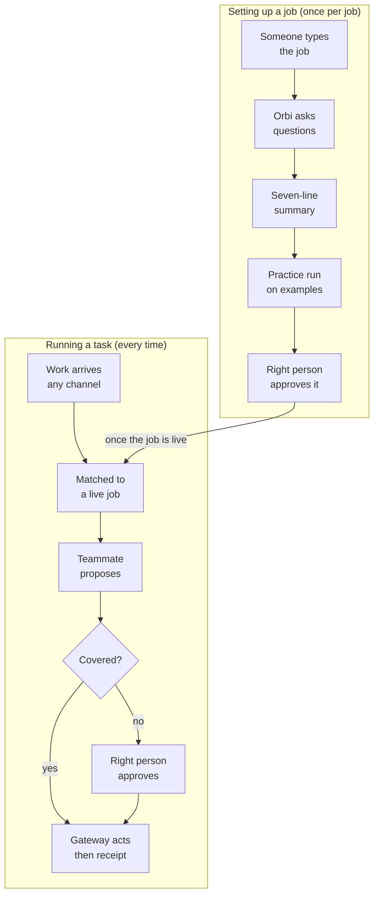
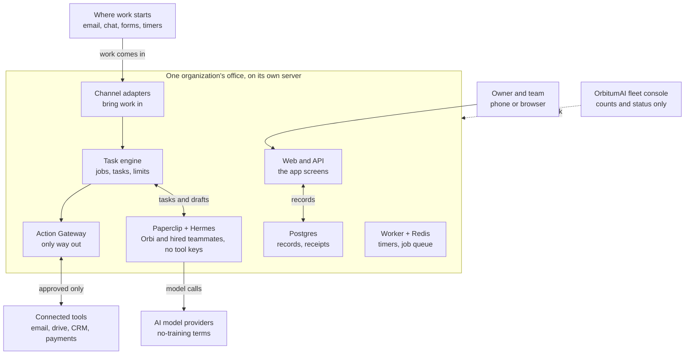
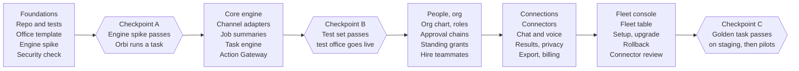

# ORBIT-OS PRD v8.0 - The AI Office for Any Organization

Oct 2, 2026 · Prepared by OrbitumAI · Product Owner: Shuv Chowdhury

## Executive summary

ORBIT-OS is where an organization gives work to a team of AI agents and people, and gets back done tasks, each with a receipt. It is not an email tool: email replies are one small job it can do among many.

**How it works, in plain words.** A person types or speaks a job, such as "approve expenses under $500 and send the rest to my CFO." ORBIT-OS repeats back what it understood: when it starts, who decides, what it may touch, the limits, and who approves. The owner confirms. From then on, every time that kind of work arrives, the system creates a task, hands it to the right AI teammate or person, asks a human before anything that matters, does the work through connected tools, and writes a receipt.

**Who uses it.**

- **User:** anyone in the organization who gives work, approves work or receives work.
- **Org Admin:** sets up the organization: departments, people, AI teammates, jobs, limits and connections.
- **Super Admin:** OrbitumAI staff who run every customer's office behind the scenes.

**Why this version exists.** v7.0 treated lead-email replies as the whole product, because v6.2 had cut the launch down to that one job. This version corrects that. The product is the layer that manages all tasks inside any organization: sales, finance, support, HR, operations and reporting.

**What is removed.** The workflow idea is gone: no canvas, no step builder, no template marketplace. The only way to give the system work is to describe a job in plain English.

**What stays.** One dedicated office per customer, an org chart of people and AI teammates, clear rules on who may approve what, a budget for each AI teammate, a receipt for every action, and connectors to other tools.

**Honest warning.** Two things are new and risky. First, your example job ("approve expenses under $500") means an AI teammate decides something. v6.2 said AI can never approve. Section 12 solves this with a Standing Authority that a human grants, with hard limits that code enforces, and open decision 2 asks you to confirm it. Second, turning loose plain English into safe, exact rules is the hardest engineering problem in the product. Section 6 shows how the system checks itself before a job goes live.

**Checklist for this document**

- [ ] Confirm the product definition in section 2.
- [ ] Decide on Standing Authority (open decision 2).
- [ ] Pick the customer-facing name (open decision 1).
- [ ] Approve the build order in section 16.

## What changed from v7.0

v8.0 changes what the product is: from a lead-reply tool to the place where an organization runs all of its tasks. Everything ships in one release, as in v7.0.

| Area | v7.0 | v8.0 |
| --- | --- | --- |
| Product | Owner-first lead replies for small firms | AI office that manages tasks across any organization |
| Unit of work | A lead email | A task, which can come from email, chat, a form, a schedule, a connected tool or a person |
| How work is given | Fixed Front Desk rules for inbound email | A job described in plain English, confirmed by a human |
| Workflows | Not exposed | Removed completely: no canvas, no step builder, no template marketplace |
| AI teammates | Orbi and Scout | Orbi, the Coordinator, plus teammates hired by department (for example Finance Clerk, Support Triager, HR Coordinator, Report Writer) |
| AI decisions | AI can never approve | AI may decide inside a Standing Authority granted by a human, with limits enforced by code |
| Org structure | Roles and a team list | Departments, teams, reporting lines, and an org chart editor |
| Customer name | Orbitcrew, tied to lead replies | Open decision 1 |
| Email replies | The whole product | One example job among many |

**Kept from v7.0:**

- One dedicated server per customer, with nothing shared
- The four roles: Org Admin, Leader, Approver, Budget holder
- Approval rules with a receipt for every action
- Per-teammate budgets with an 80% warning and a 100% pause
- MCP connectors and the policy gateway
- The fleet console for OrbitumAI
- Content-free notices, the 30-second undo, and the design rules (black and white, one red, Inter)

**Removed or shrunk:**

- The lead classifier, the acknowledgment template and the Front Desk's email-only logic become one example job and one intake channel.
- Scout becomes one example teammate (a Sales Analyst).
- Anything described only in terms of leads is reworded in terms of tasks.

**Stays out of scope** (declined earlier, and not requested back): public self-signup, one shared platform for all customers, a template marketplace, a public API and SDK, white-label, Telegram, Google sign-in and passkeys.

## Market and competitors

The market for AI agents is large and growing fast, but it is crowded and still unsettled, so ORBIT-OS must win on trust and fit, not on features alone. Figures below are analyst estimates as of October 2026, and they disagree by about a factor of three.

**Market potential**

| Source | Estimate |
| --- | --- |
| [MarketsandMarkets](https://www.marketsandmarkets.com/Market-Reports/ai-agents-market-15761548.html), as reported by [Toolradar](https://toolradar.com/reports/state-of-ai-agents-2026) | $7.84 billion in 2025 to $52.62 billion by 2030 (46.3% a year) |
| [Grand View Research](https://www.grandviewresearch.com/industry-analysis/ai-agents-market-report), as reported by Toolradar | $10.9 billion in 2026 to $182.9 billion by 2033 (49.6% a year) |

Two more facts matter for a small-business product. A 2026 [SBE Council survey of 517 small employers](https://www.clickpost.ai/blog/ai-agents-for-small-businesses) found 82% have invested in AI tools. And Gartner warns that over 40% of agentic AI projects are at risk of cancellation by 2027 because of cost and unclear value, per Toolradar. That second fact is the opening: buyers want agents but fear runaway cost and loss of control, which is exactly what budgets, approvals and receipts address.

**Competitors**

| Competitor | What it is | How ORBIT-OS differs |
| --- | --- | --- |
| [Zapier Agents](https://composio.dev/blog/best-ai-agent-platforms) | Agents set up in plain English on top of Zapier's connections | Zapier is self-serve and built around the user's own apps. ORBIT-OS adds an org chart, approval authority and a dedicated office per customer. |
| Lindy | No-code agent builder for founders and small teams | Lindy is personal and build-it-yourself. ORBIT-OS is managed and shared by the whole organization. |
| Relevance AI | Multi-agent "AI workforce" for sales and operations | Closest in idea. Aimed at teams that build agents themselves; ORBIT-OS removes the builder. |
| [Asana AI Teammates](https://www.businesswire.com/news/home/20250925695672/en) | AI agents that work inside Asana's task platform, positioned as the OS for human-agent teams | Strongest direct rival. It lives inside Asana, so it needs the customer to already run on Asana. ORBIT-OS works across any tools. |
| monday.com Digital Workers | AI agents inside monday.com | Same pattern as Asana: tied to one work platform. |
| Microsoft 365 Copilot and Salesforce | AI built into suites people already use | Strong where the customer is already inside those suites. ORBIT-OS is neutral and simpler to start. |
| Claude Cowork | Agentic desktop app that helps one person with knowledge work | Personal helper. ORBIT-OS is the shared layer: who may approve what, budgets per agent, one audit trail. |
| ChatGPT Agent | General-purpose agent for research and everyday tasks | Same: individual, not organizational. |
| n8n | Workflow automation tool, popular with technical teams, that can be self-hosted and add AI steps | Workflow-first: the user builds and maintains the flows. ORBIT-OS has no flow builder, and adds an org chart, approval authority, per-agent budgets and a managed, isolated office. |
| Paperclip and Hermes used directly | The open-source parts ORBIT-OS is built on: Paperclip governs agents and tasks, Hermes does the reasoning | Not rivals today, because they sit inside ORBIT-OS. A technical team could run them alone, so they are the do-it-yourself alternative. ORBIT-OS adds the org chart, approvals, receipts and managed setup. It also depends on them, so an upstream change is a risk. |

**Where ORBIT-OS can win** (my assessment, to test with customers):

- **Authority built in:** who may approve what is part of the product, not an afterthought.
- **Isolation:** every customer gets a separate office, which suits firms that worry about data.
- **Plain English only:** no builder to learn, so a non-technical owner can use it on day one.
- **Cost control:** a budget per AI teammate and a receipt for every action answers the cancellation risk.
- **Managed setup:** OrbitumAI sets it up and runs a weekly call, which self-serve rivals do not offer.

**Where it is weak**

- Self-serve rivals start at roughly $20 to $80 a month on [vendor comparison pages checked in June 2026](https://tinycommand.com/ai-agents/best-no-code-ai-agent-platforms), though those pages disagree on exact prices.
- Asana, monday.com and Microsoft already own where work lives.
- Managed setup and one server per customer limit how fast you can grow. The ops trigger in section 10 is set at 25 offices.
- The category is churning: 28% of the 773 agent tools Toolradar tracks appeared in the last 90 days.

## Goals, non-goals and success metrics

The release succeeds when an organization hands real work to its AI office in plain English, trusts what comes back, and gets hours back every week. The one number on the wall is hours given back per customer per week, carried over from the Vision document.

**Goals**

- A new Org Admin gives the office its first job in plain English and confirms it in under 10 minutes.
- Every job is repeated back in plain words and tested on examples before it goes live.
- No outside action and no decision above a limit happens without a recorded person or a recorded Standing Authority.
- Every task has a receipt: what was done, why, who approved it, when, and the cost.
- An AI teammate that reaches its budget pauses alone; nothing else stops.
- An idle office makes no AI calls except Orbi's Friday review.
- Setup, upgrade, backup, restore and shutdown of an office are scripted or one-click.

**Non-goals**

- Any workflow canvas, step builder, flow editor or template marketplace.
- A shared platform where customers' data sits together.
- Replacing the tools people already use. ORBIT-OS connects to them.

**Success metrics** (proposed targets; confirm after the test office)

| Stage | Measure | Target |
| --- | --- | --- |
| Test office (OrbitumAI itself, founder holds every role) | Real jobs running across at least 3 departments | 5 or more jobs |
| Test office | Decisions or sends without a recorded approval or Standing Authority | 0 |
| Test office | Jobs whose practice run matched what the owner meant | 90% or better |
| Test office | Idle model calls | 0 (except the Friday review) |
| Pilots | Time from sign-in to first confirmed job | Under 10 minutes |
| Pilots | Org Admins who complete a live run within 24 hours | 50% |
| Pilots | New office set up with no manual steps | Under 15 minutes |
| Pilots | Teams with 2 or more people approving work | 50% within 30 days |
| Pilots | Override or edit rate over 4 weeks | Falling |
| Pilots | NPS | Above 40 |
| Business | Hours given back per customer per week | Measured nightly as an estimate; Vision target of 10 hours at scale |
| Fleet | Unplanned upgrade rollbacks | 0 |
| Fleet | Operator time per office | Tracked monthly; add help at 25 offices or 10 hours a week for 4 weeks |

If a target is missed: a low practice-run match means the job-understanding step is fixed before more customers are added; a rising override rate means the teammate's instructions or limits are reviewed; any breach of a Standing Authority switches that authority off immediately until the cause is fixed.

## Core ideas in plain words

The whole product rests on six ideas, and there is no seventh called a workflow.

| Idea | What it means | Example |
| --- | --- | --- |
| Job | A standing instruction written in plain English. It says what to watch for and what to do. | "Approve expenses under $500 and send the rest to my CFO." |
| Task | One piece of work created when something triggers a job, or when a person asks. | One expense request from Dana for $212. |
| Teammate | The person or AI agent who does a task. AI teammates are hired from ready-made roles. | Finance Clerk (AI), or Priya, the CFO. |
| Approval | A person's yes, or a Standing Authority a person granted with hard limits. | The CFO approves the $1,800 request. |
| Receipt | The record of what was done, why, by whom, approved by whom, when, and at what cost. | Receipt for the $212 approval. |
| Office | One customer's private installation: its people, teammates, jobs, limits and connections. | assistant.hartwell.example |

**Jobs are text, not diagrams.** A job has no steps to drag and no boxes to connect. A person writes it in everyday words. ORBIT-OS then shows a plain summary of what it understood, and the person confirms it. Changing a job means changing its words and confirming again.

**What a job summary shows.** Every job summary has the same seven lines, so people learn to read it once:

- **When:** what starts it (an email arrives, a form is sent, every Friday, a person asks).
- **Who does it:** the AI teammate or person.
- **What it may touch:** which connected tools it may read or change.
- **Limits:** amounts, counts, hours, cost.
- **Who approves:** the person, or the Standing Authority and its limit.
- **If nobody answers:** the reminder and the person it moves up to.
- **Examples:** three real or made-up cases showing what would have happened.

**Example jobs, in the words an owner might type.** These show the range; they are not templates.

| Department | Job |
| --- | --- |
| Finance | "Approve expenses under $500 and send the rest to my CFO." |
| Sales | "When a new lead emails, send a short thank-you and draft a reply for me to approve." |
| Support | "Sort customer questions into billing, technical or other, and flag anyone who sounds angry." |
| HR | "Collect time-off requests and send each to the right manager." |
| Operations | "Every Friday, gather this week's orders into a short report for me." |
| Management | "Remind me about any proposal that has had no answer for five days." |

## How a plain-English job becomes done work

A job is checked before it goes live, and each task it creates is checked again before anything leaves the office.

The top lane happens once per job. The bottom lane happens for every task. "Covered" means a Standing Authority that a Leader granted covers this exact kind of action, within its limit. If it is not covered, a person approves, and a declined request closes the task with a receipt.

**What keeps this safe**

- **Orbi never guesses.** A gap in a job gets a question, not an assumption.
- **The practice run touches nothing.** It uses examples and shows what would have happened.
- **The right person activates the job.** Nobody can activate a job that needs more authority than they hold.
- **Limits are numbers, enforced by code.** The AI proposes. Fixed checks decide what is allowed.
- **One gate out.** Only the Action Gateway sends anything outside the office, and it refuses any action with no valid approval or covering Standing Authority.

## Users, roles and the AI team

Three kinds of person use the product, and four roles decide who may approve what inside one organization.

| Who | What they do | Where they work |
| --- | --- | --- |
| User | Gives work, approves work, receives work | The app on phone or desktop |
| Org Admin | Sets up departments, people, AI teammates, jobs, limits and connections | Settings, Team, Jobs in the same app |
| Super Admin | Runs every customer's office (OrbitumAI staff only) | The fleet console, over a private network |

**Roles inside an office.** A person can hold more than one. In a small firm the owner often holds all four.

| Role | Plain meaning |
| --- | --- |
| Org Admin | Runs the office: people, jobs, rules, connections, billing |
| Leader | Approves the big decisions (money above a limit, commitments, legal, people matters) and grants Standing Authority |
| Approver | Approves everyday work inside their department |
| Budget holder | Approves higher spending limits for AI teammates and connectors |

The Super Admin never holds a role inside a customer's office. Support access is a logged "view as customer" session that the owner has allowed.

**Org structure.** An office has departments (for example Sales, Finance, Support, HR, Operations), teams inside them, and reporting lines. People and AI teammates both appear on the chart. Each job belongs to a department, and each department has a default Approver and an escalation path.

**AI teammates.** They are not people. Each one has a role, a budget, a list of tools it may use, and a record of what it has done.

- **Orbi, the Coordinator (always present):** turns what people type into job summaries, asks questions when a job is unclear, triages tasks that match no job, takes over stuck tasks, writes the Friday review and answers in chat.
- **Hired teammates:** an Org Admin hires them from a short list of ready-made roles, for example Finance Clerk, Sales Analyst, Support Triager, HR Coordinator and Operations Reporter. Which tools each may use is set when it is hired and checked by code, not by the AI.
- **A teammate cannot grant itself anything.** More tools, a bigger budget or a wider Standing Authority always need a human decision.

Intake and sending are done by ordinary software, not by an AI teammate: channel adapters bring work in, and a single Action Gateway carries every outside action out (see section 14).

## User features

The User can give work in plain words, approve work in under a minute from a phone, and always see what was done in their name. Status column: **Kept** = carried from v7.0, **Reworked** = changed to fit tasks instead of lead emails, **New** = added in v8.0.

**Getting in**

| ID | Feature | In plain words | Status |
| --- | --- | --- | --- |
| U-01 | Email sign-in link | No password. A link in your email signs you in; it works once and expires in 15 minutes. | Kept |
| U-02 | 30-day session | You stay signed in for 30 days. Risky actions (money, commitments) ask for a fresh sign-in if it has been over a day. | Kept |
| U-03 | Password and authenticator code | Optional password plus a code from an authenticator app. | Kept |
| U-04 | Face ID or Touch ID | Confirm an approval with your face or fingerprint (open decision 4). | Kept |

**Giving work**

| ID | Feature | In plain words | Status |
| --- | --- | --- | --- |
| U-10 | Ask for one task | Type or speak what you need, such as "book the March team dinner under $600". Orbi creates the task and tells you who has it. | New |
| U-11 | Describe a standing job | Write a job in everyday words. If it needs a bigger person's approval, it goes to them. | New |
| U-12 | Check the job summary | Orbi repeats back what it understood in seven plain lines and asks questions if anything is unclear. You approve, edit or cancel. | New |
| U-13 | Practice run | See what the job would have done on real or made-up examples before it goes live. | New |
| U-14 | Forward or upload | Forward an email or upload a file to start a task. | New |
| U-15 | Task board | Three lists: waiting for me, assigned to me, I asked for. | Reworked |
| U-16 | Task page | What the task is, who has it, status, evidence, history and receipt. | Reworked |
| U-17 | Comment or ask Orbi | Add a note to a task, or ask Orbi "where is this?" | New |
| U-18 | Cancel or reassign | Stop a task, or move it to another person or AI teammate within your authority. | New |

**Approving**

| ID | Feature | In plain words | Status |
| --- | --- | --- | --- |
| U-20 | Waiting for you | A list of things that need you, oldest first, each with a countdown to when it expires (72 hours). | Kept |
| U-21 | Approval page | See the request, the evidence, and exactly what happens if you approve. Nothing happens until you press a button. | Reworked |
| U-22 | Edit before approving | Change the proposed action, wording or amount right on the page. Both versions are saved on the receipt. | Kept |
| U-23 | Decline with a reason | Decline and say why, so the teammate improves. | Kept |
| U-24 | Six safe states | Clear screens for: expired, already decided, request changed, sending or failed, office paused, not yours. | Kept |
| U-25 | Ask the leader | If a request is above your level, one tap sends it to a Leader with a note. | Kept |
| U-26 | Snooze | Hide a request until a time you pick. The expiry clock keeps running. | Kept |
| U-27 | Undo | A 30-second window to stop an outside action (an email, a payment request) before it goes out. | Kept |
| U-28 | I'm away and delegation | Hand your approvals to someone you choose, for a set time, with a log. | Kept |

**Staying informed**

| ID | Feature | In plain words | Status |
| --- | --- | --- | --- |
| U-30 | Home | Waiting for you, today's work in one line, recent receipts, and last week's review. | Reworked |
| U-31 | Receipts | One for every action: what was done, why, who approved, times, cost. | Reworked |
| U-32 | Email alerts | A short email when something waits for you. It never contains private details. | Kept |
| U-33 | Phone push alerts | The same alerts as phone notifications. | Kept |
| U-34 | Lock-screen actions and widget | Open or snooze from the notification. A Home Screen widget shows the waiting count (open decision 5). | Kept |
| U-35 | Why did it do this? | Shows what the teammate used: the request, the job's words, the facts file. | Reworked |
| U-36 | Weekly reviews | Every Friday review, not only the newest. | Kept |
| U-37 | Search | Search tasks and receipts by words, person, date or department. | New |
| U-38 | Hours given back | An estimate of time saved, shown on Home and in the review. | Reworked |

**Talking to Orbi**

| ID | Feature | In plain words | Status |
| --- | --- | --- | --- |
| U-40 | Chat with Orbi | Ask in plain words: "what is waiting?", "what did Finance approve today?" Orbi answers only from data you are allowed to see. | Kept |
| U-41 | Voice | Speak to Orbi instead of typing. | Kept |
| U-42 | Light and dark mode | Follows the phone setting. | Kept |

## Org Admin features

The Org Admin can build the organization inside the product, hire AI teammates, approve the jobs people describe, and set every limit, without asking OrbitumAI for help except for server-level work. Same status labels as the User section.

**Setup and structure**

| ID | Feature | In plain words | Status |
| --- | --- | --- | --- |
| A-01 | Guided setup | A short checklist with a progress bar: name the organization, add departments, invite people, connect tools, give the first job. | Reworked |
| A-02 | Departments and teams | Create departments and teams, with a default Approver and escalation path for each. | New |
| A-03 | Org chart editor | Drag people and AI teammates into place to show who reports to whom. | Kept |
| A-04 | Invite people | Send an invitation that works once and expires in 7 days. | Kept |
| A-05 | Roles | Give each person Org Admin, Leader, Approver or Budget holder. Authority is checked at the moment of each decision. | Kept |
| A-06 | Backups and escalation | Name a backup for each approver. If nobody answers, work moves up the chain (2 hours, 2 hours, then 24 hours; editable). | Kept |
| A-07 | Delegation and role requests | Approve a delegation or a request for a bigger role, with an end date. | Kept |
| A-08 | Empty Leader rule | If the Leader seat is empty, a stated fallback applies. | Kept |

**AI teammates**

| ID | Feature | In plain words | Status |
| --- | --- | --- | --- |
| A-10 | Hire AI teammates | Pick a ready-made role (Finance Clerk, Sales Analyst, Support Triager, HR Coordinator, Operations Reporter), set its budget, and see it join the chart. | Reworked |
| A-11 | Teammate profile | One page per teammate: its role, tools, limits, jobs, cost and full record. | New |
| A-12 | Pause or retire a teammate | One switch pauses it; retiring keeps its record. | New |
| A-13 | Tool permissions | Choose which connected tools each teammate may read or change. | New |

**Jobs**

| ID | Feature | In plain words | Status |
| --- | --- | --- | --- |
| A-20 | Jobs library | Every standing job in plain English with its status, owner, last run and cost. | New |
| A-21 | Job review | Approve, edit or retire jobs that people described. Nothing goes live until the right person approves. | New |
| A-22 | Job limits | Set amounts, counts, hours and cost limits on a job. Code enforces them. | New |
| A-23 | Standing Authority | A Leader lets a teammate decide inside a limit, such as "approve expenses under $500", with an end date. | New |
| A-24 | Job history | Every wording change, who approved it and when, with the option to go back. | New |
| A-25 | Starter phrases | Example job sentences for each department to start from. They are examples, not templates. | New |
| A-26 | Conflict check | Warns when two jobs claim the same kind of work. | New |
| A-27 | Practice mode | Run any job on made-up or past examples without touching real tools. | New |

**Control and safety**

| ID | Feature | In plain words | Status |
| --- | --- | --- | --- |
| A-30 | Pause the whole office | One switch stops all new work and all outside actions. | Kept |
| A-31 | Pause one job | Stop a single job without touching the rest. | New |
| A-32 | Rules | Simple rules such as "anything over $500 needs the CFO." Rules can only add caution, never remove it. | Kept |
| A-33 | Rule suggestions | The system proposes a rule after repeated overrides; you accept or reject it. | Kept |
| A-34 | Office-changes approval | Changes to rules, costly hires, Standing Authority and budget raises need a named approver. | Kept |
| A-35 | Activity log | A readable list of who approved what, using which authority. | Kept |
| A-36 | Business and quiet hours | Choose when alerts may reach people and when outside actions may go out. | Kept |
| A-37 | VIP and never-touch lists | People or senders that are always handled by a person, or never touched. | Kept |
| A-38 | Data boundaries | Choose which department's data each teammate may see. | New |
| A-39 | Reconnect a tool | If a connected tool signs you out, the affected jobs pause and a button reconnects it. | Kept |

**Spending**

| ID | Feature | In plain words | Status |
| --- | --- | --- | --- |
| A-40 | Spending view | Spend against limit for the company, each AI teammate, each connector and each job. | Reworked |
| A-41 | Budget warnings | A warning at 80% and a pause at 100%, per teammate. | Kept |
| A-42 | Change limits | Raise or lower limits yourself; raising needs the Budget holder. | Kept |
| A-43 | Plan and invoices | See your plan, upgrade it, download invoices. | Kept |
| A-44 | Cost per job and task | See what each job and each task cost. | New |

**Connections and data**

| ID | Feature | In plain words | Status |
| --- | --- | --- | --- |
| A-50 | Connections screen | See and manage every connected tool (section 13). | Reworked |
| A-51 | Intake channels | Choose which inboxes, chats, forms and schedules may create tasks. | New |
| A-52 | Results page | Tasks done, hours given back (an estimate), override rate, cost per job. | Reworked |
| A-53 | Privacy page | Shows what the AI saw and where it went. | Kept |
| A-54 | Export and delete | Download all receipts and data, or delete the office, completed within 30 days. | Kept |
| A-55 | Optional training data | If you choose, share redacted examples to improve the product. Off unless you agree. | Kept |
| A-56 | Connections belong to the business | If the person who connected a tool leaves, the connection stays. | Kept |

## Super Admin features

The Super Admin can run every customer's office from one console and prove that no office leaks into another. The console shows counts and status only, never a customer's tasks, emails or documents. Access is OrbitumAI staff over a private network, with two-step sign-in. Connector controls for the Super Admin are in section 13.

**Running the fleet**

| ID | Feature | In plain words | Status |
| --- | --- | --- | --- |
| S-01 | Set up a new office | Enter six facts (name, domain, plan, owner email, website, calendar link). The office runs in under 15 minutes with no manual steps. | Kept |
| S-02 | Setup tracker | Shows each new customer's step and where it is stuck. | Kept |
| S-03 | Upgrade | Maintenance notice, backup, apply, security check, test, then done or roll back within 10 minutes. | Kept |
| S-04 | One-click rollback | Return an office to the previous version if an upgrade goes wrong. | Kept |
| S-05 | Upgrade calendar | One upgrade day per month, with automatic notice to customers. | Kept |
| S-06 | Test office | A staging office tries every new version first. | Kept |
| S-07 | Backup and restore | Nightly backups kept 30 days, restore to the same or a new server, a monthly practice restore. | Kept |
| S-08 | Pause, pause all | Pause one office or all of them. | Kept |
| S-09 | Shut down an office | Needs the customer's written request and the owner's confirmation. Export first, deletion after 30 days. | Kept |
| S-10 | Fleet console | Every office with health, versions, backups, team status, connections, incidents, requests waiting over 24 hours, spend this month and operator minutes. | Kept |

**Safety and trust**

| ID | Feature | In plain words | Status |
| --- | --- | --- | --- |
| S-20 | Security check | After every setup and upgrade: no public ports, engines hold no tool keys, every outside action passes the Action Gateway, versions match. A failure blocks "healthy". | Reworked |
| S-21 | Alerts | Emails when a server is down, a backup is missed or an outside action fails. | Kept |
| S-22 | AI provider outage warning | Flags offices affected when the AI provider is down. | Kept |
| S-23 | Operator audit | Every operator action is logged inside the affected office, where the owner can read it. | Kept |
| S-24 | Two-step sign-in for operators | Required for the console and the engine screens. | Kept |
| S-25 | View as customer | A support view that the owner must allow, with a visible banner and a log. | Kept |
| S-26 | Status page and incident log | A public status page and a private list of incidents. | Kept |
| S-27 | Evidence pack | A ready set of security and privacy proof for customers who ask. | Kept |

**Money and quality**

| ID | Feature | In plain words | Status |
| --- | --- | --- | --- |
| S-30 | Operator time tracking | Minutes per office each month. Add help at 25 offices or over 10 hours a week for 4 weeks. | Kept |
| S-31 | Cost analytics | Spend by office, teammate and AI model. | Kept |
| S-32 | Profit per customer | What each customer pays against what they cost to run. | Kept |
| S-33 | Job quality scoreboard | Per office: how often the practice run matched what the owner meant, and how often people override a teammate, trending over time. | Reworked |
| S-34 | Skills review queue | Review any new skill an AI teammate proposes before it can be used. | Kept |
| S-35 | Teammate role library | Manage the ready-made roles customers can hire from, and the starter job phrases for each department. | Reworked |
| S-36 | Overrides | Change a limit or setting for one office with a logged reason. | Kept |
| S-37 | Settings panel | Per-office settings with a Test connection button for the engine, the Action Gateway, intake channels and email. | Kept |
| S-38 | Nightly numbers | Each office sends numbers only (tasks, approvals, overrides, cost, health) to the fleet database. | Kept |

**New in v8.0**

| ID | Feature | In plain words | Status |
| --- | --- | --- | --- |
| S-40 | Job-understanding test set | A fixed set of example jobs is re-run before any prompt or model change, to catch jobs the system now misunderstands. | New |
| S-41 | Standing Authority watch | Numbers across offices: how many are active, how often they are used, and any breach that switched one off. | New |
| S-42 | Model routing and usage | Which AI model handles which part of the work, and the cost of each. | New |

## Job and task engine requirements

The engine turns a plain-English job into safe, exact limits, then runs every task under those limits; a model may help understand and draft, but fixed code decides what is allowed.

**Bringing work in (intake)**

- **INT-1 Channels:** work can arrive by email, chat message, a form link, a person in the app, a forwarded email or uploaded file, a schedule (for example every Friday), or an event from a connected tool. Each channel is a separate adapter, so adding one never changes the engine.
- **INT-2 Hostile input:** everything that arrives is treated as hostile. Rules strip signatures and quoted history, drop receipts, newsletters, codes and password resets, and cut long text before any AI sees it.
- **INT-3 No duplicates:** the same item never creates two tasks, and later messages in a thread are handled by the rules of the job that owns it.
- **INT-4 Matching:** each new item is matched to a job by its words, sender, channel and department. If no job matches, it becomes an unmatched task for Orbi to triage; Orbi may ask a person, and never guesses on money, commitments, legal or people matters.
- **INT-5 Known sources:** a person or sender the office already works with is handled by the job's rules for known sources, not treated as a stranger.

**Understanding a job**

- **JOB-1 Plain English only:** a job is written as text. There is no step editor, canvas or flow builder, and none may be added.
- **JOB-2 Questions first:** if anything is unclear (a limit, a person, a tool), Orbi asks up to three short questions at a time. It never fills a gap with a guess.
- **JOB-3 Seven-line summary:** Orbi repeats the job back as when, who does it, what it may touch, limits, who approves, if nobody answers, and examples. Fixed code, not the model, turns that summary into the exact limits the engine enforces.
- **JOB-4 Honest refusal:** Orbi says plainly when a job cannot be done safely or with the connected tools, and says why.
- **JOB-5 Practice run:** before activation, the job runs on real past items or made-up ones, with no outside action. The person sees what would have happened and can fix the wording.
- **JOB-6 Activation needs the right person:** the person who described the job can activate it only if they hold the authority it needs. Otherwise it goes to a Leader or Approver.
- **JOB-7 Versions:** every wording change is a new version and needs approval again. Old versions stay in the job history.
- **JOB-8 No overlaps:** two active jobs may not claim the same trigger without a clear order; the conflict check (A-26) blocks activation until a person resolves it.
- **JOB-9 Retire and pause:** a job can be paused or retired at any time. Open tasks from a retired job are finished or reassigned by a person.

**Doing a task**

- **TASK-1 States:** New, Assigned, In progress, Waiting for approval, Done, Failed or Cancelled. Each change is recorded.
- **TASK-2 Assignment:** the job names the teammate or person. A person may reassign within their authority.
- **TASK-3 Evidence:** the teammate attaches what it used: the request, the job's words, facts it read, and what it proposes to do.
- **TASK-4 Risk category:** fixed checks set the category (routine, decline or refer, high-risk, office change) from amounts, words, recipients and the tool involved. A model may raise a category, never lower it.
- **TASK-5 Sub-tasks:** a teammate may create sub-tasks only inside its job's limits and only for teammates or people the job allows.
- **TASK-6 Time and escalation:** each task has reminder and expiry times (reminder at 2 hours, expiry at 72 hours by default, editable per job) and moves up the escalation path when nobody answers.
- **TASK-7 Stuck tasks:** a task that stalls, or a teammate that returns a broken result twice, goes to Orbi and appears in the daily digest.
- **TASK-8 Never lost:** every pending step is a database row. Redis only runs jobs, and a check every minute re-queues anything it lost.
- **TASK-9 Receipts:** every finished, failed or cancelled task writes a receipt.

## Approvals, standing authority, budgets and cost

Nothing consequential happens without a recorded person or a recorded Standing Authority that a person granted, and the AI can only make the rules stricter, never looser. This is the single place the approval rules are stated.

**Three kinds of approval**

- **Per-action approval:** a person says yes to one specific action. It is tied to one task and one decision.
- **Standing template approval:** a person approves a fixed piece of text once (for example a short thank-you reply). Only that exact text may go out under it, and any wording change needs approval again.
- **Standing Authority:** a Leader lets an AI teammate decide inside hard limits, such as "approve expenses under $500." This is new in v8.0. It changes the v6.2 rule "AI can never approve", so open decision 2 asks you to confirm it.

**How Standing Authority is kept safe**

- A Leader grants it in writing, and the grant names the teammate, the category, a numeric limit (amount, count per day, or both), and an end date.
- Fixed code enforces the limit, not the AI. A request over the limit, or in another category, is sent to a person automatically.
- Every use is recorded with the grant it relied on and the person who granted it.
- Any breach, or any use that a person marks "wrong", switches that authority off at once and alerts the Leader. Switching it back on is manual.
- It never covers: hiring or removing people, signing or agreeing to contracts, changing roles, limits or budgets, deleting data, or sending anything to an outside person that is not a fixed approved text. These always need a person.
- It is deciding only. Moving money out of the organization is a separate outside action and follows the outside-action rules below.

**Who approves what**

| Kind of work | Who approves | If nobody answers |
| --- | --- | --- |
| Routine, inside a department | Approver, or anyone above, or a Standing Authority | Reminder at 2 hours, then the backup, then escalate |
| Decline or refer | Approver, or anyone above | Same |
| High-risk: money above a limit, commitments, legal, people matters, more than one outside recipient | Leader | Escalate up the chain; if still silent the request expires at 72 hours |
| Office change: new job, new rule, costly hire, Standing Authority, budget increase | Org Admin, Leader or Budget holder, by type | Request stays open and is listed in the digest |

**Outside actions.** Anything that leaves the organization (an email, a payment request, a message in a connected tool, an update in another system) goes through the Action Gateway (section 14). The gateway refuses any outside action that has no valid approval ID, no valid standing template approval, or no valid Standing Authority that covers it. A 30-second undo window applies to every outside action a person approved.

**Rules that never change**

- The category is the most sensitive of the teammate's flags and the fixed checks.
- Authority is checked at the moment of decision and recorded with it.
- The first valid decision wins. A second attempt sees "already decided."
- Approval links are signed, work once, are tied to one decision and expire with the request. Opening one never acts.
- High-risk actions need a sign-in under 24 hours old.
- AI teammates cannot approve outside a Standing Authority, cannot widen their own tools, and cannot change a limit.
- Board actions on the AI engine (hires, budget changes) run through ORBIT's service account only after the matching human decision is recorded.

**Budgets**

- Each AI teammate has a monthly budget, a daily cap on cheap checks, and a turn limit.
- At 80% the owner is warned. At 100% that teammate pauses and nothing else does.
- If a teammate is paused, its tasks go to Orbi; if Orbi is also paused, they wait with a digest entry.
- Each connector has its own daily call and cost limit (section 13).
- An idle office makes no AI calls except Orbi's Friday review. There are no scheduled wake-ups.

**Cost records.** Every AI call is logged with model, tokens, cost, time and result. Receipts, spending screens and the cost-per-job view read from that log.

**Pricing.** The office is priced as one unit. Before the first customer is quoted, a unit-economics sheet must show a positive margin per plan using the measured server size and AI cost. The price and setup fee are open decision 9.

## MCP connectors: who adds and manages them

The Org Admin adds and removes connectors for their own office, OrbitumAI controls which connectors are allowed at all, and no connector can act in the organization's name without the normal approval. MCP connectors are the plug-ins that let AI teammates read from or act in other tools such as email, calendars, drives, HubSpot, Slack, Stripe, Notion, accounting tools, or a customer's own server.

**Who can do what**

| Action | User | Org Admin | Leader | Super Admin |
| --- | --- | --- | --- | --- |
| See which connectors are on and their status | Yes | Yes | Yes | Counts only |
| Add an approved connector that only reads | No | Yes | Not needed | No |
| Add an approved connector that can change things (send, create, update, pay) | No | Proposes | Approves | No |
| Request a custom connector (the customer's own server) | No | Yes | Approves | Reviews |
| Pause or remove a connector in the office | No | Yes | Yes | Emergency pause only |
| Change which actions a connector may do | No | Proposes | Approves | No |
| Add, approve, retire or block a connector for all offices | No | No | No | Yes |
| Block a connector in one office | No | No | No | Yes, logged |

**Two tiers of connectors**

- **Approved catalog:** connectors OrbitumAI has reviewed and pinned to a version. An Org Admin can add these from a list.
- **Custom connector:** the customer's own MCP server. It cannot go live until the Super Admin has reviewed it. It starts read-only.

**Connection features**

| ID | Role | Feature | In plain words |
| --- | --- | --- | --- |
| C-01 | Org Admin | Connections screen | One list of every connector with status, who connected it, last used, which teammates and jobs use it, and what it can read or change. |
| C-02 | Org Admin | Browse the catalog | Pick from approved connectors, each with a plain-words description. |
| C-03 | Org Admin | Add a connector | Choose it, sign in with the provider, review permissions, get the needed approval, run a test, then switch it on. |
| C-04 | Org Admin | Permission review | Every action is shown as "can read" or "can change things." You tick the ones you allow. Everything starts read-only. |
| C-05 | Org Admin | Approval for changes | An action that sends, pays or changes something outside runs only under an approval or a covering Standing Authority. Nothing runs on its own. |
| C-06 | Org Admin | Pause or remove | One switch pauses a connector. Removing it revokes and deletes its sign-in. |
| C-07 | Org Admin | Request a custom connector | A short form: server address, what it is for, who runs it. It goes to the OrbitumAI review queue and shows its status. |
| C-08 | Org Admin | Connector activity | What each connector read or did, when, for which task, and who approved it, inside the activity log. |
| C-09 | Org Admin | Connections belong to the business | If the person who connected it leaves, the connection stays and is reassigned. |
| C-10 | Org Admin | Sign-in expiry alerts | A warning before a connector's sign-in expires, with a Reconnect button. Jobs that depend on it pause if it lapses. |
| C-11 | Org Admin | Per-connector limits | Daily call and cost limits for each connector, with the 80% warning and 100% pause used for AI teammates. |

**Operator features**

| ID | Role | Feature | In plain words |
| --- | --- | --- | --- |
| C-20 | Super Admin | Connector catalog | Add, approve, retire and pin a version of each connector. Every tool is marked read or change. |
| C-21 | Super Admin | Custom connector review queue | A checklist: who runs the server, what data goes there, the tool list, a test on staging. Approve for one office, approve for the catalog, or reject with a reason. |
| C-22 | Super Admin | Per-office switches | Enable, disable or block a connector for one office, with a logged reason. |
| C-23 | Super Admin | Change watch | If a connector adds or changes a tool, it pauses in every office until re-reviewed. |
| C-24 | Super Admin | Connector health | Status counts per connector across offices, never customer content. |
| C-25 | Super Admin | Revoke everywhere | If a provider is compromised, revoke and rotate its sign-ins in all offices at once. |
| C-26 | Super Admin | Gateway rules | Allowed destinations, rate limits and size limits, tested in CI. |

**Safety rules built into every connector**

- **C-30 Gateway only:** every connector call goes through the Action Gateway. AI teammates never hold a sign-in token and never talk to a connector directly.
- **C-31 Results are untrusted:** whatever a connector returns is treated like a hostile email. It cannot raise permissions, trigger an action or change an approval.
- **C-32 Privacy page:** the Privacy page (A-53) lists every connector that can see data and what it may receive.
- **C-33 Same approval rule:** the test that blocks any outside action without a valid approval or Standing Authority also covers every connector action that changes something.

**Open decisions for connectors**

| Decision | My suggestion |
| --- | --- |
| Can a customer add their own MCP server at all? | Yes, but only after Super Admin review, and read-only by default. |
| Who reviews a custom connector, and how fast? | The Super Admin, with a target answer time you set. |
| Do connector costs count against the AI budget or their own? | Their own budget per connector (C-11). |
| Which connectors are in the first catalog? | Email, Calendar, Drive, Slack, HubSpot, Stripe, Notion, then WhatsApp once Meta approves. |
| Does a Leader approve every change-capable connector, or only above a risk level? | Every one, until you have seen how often it happens. |

## Architecture, data, security and compliance

Every customer gets a complete, separate office on its own server, and every action that leaves the office passes through one gate that checks for approval.

Read the picture top down: work starts in email, chat, forms or timers, and channel adapters bring it in. The task engine hands tasks to Orbi and the hired teammates. The teammates only propose actions, and the Action Gateway is the only way anything reaches a connected tool.

**How the office is built**

- **One office per customer:** web, API, worker, channel adapters, task engine, Action Gateway, Redis, Paperclip, Hermes and one Postgres server with two databases (orbit and paperclip) and separate logins. Nothing is shared with other customers.
- **Action Gateway:** the single piece of code that holds connector sign-ins and sends outside actions. It replaces the v7.0 Front Desk sender and the connector gateway. It refuses any action with no valid approval, standing template approval or Standing Authority.
- **Own address:** each office lives on `assistant.<customer-domain>` through a CNAME the customer adds. Certificates are automatic.
- **Same recipe every time:** offices are built from one versioned template. Only settings and secrets differ.
- **OrbitumAI operates it:** customers never touch servers, containers or engine screens. Engine screens are reachable only over OrbitumAI's private network.
- **Pending work lives in the database:** Redis only runs jobs. A check every minute re-queues anything Redis lost.
- **Client-hosted offices:** the same template can run on a customer's own server under a contract (Enterprise tier). Not at launch.

**Keeping customers and teammates apart**

- No database, queue or AI engine port is open to the internet.
- The AI engine runs in its own container with no connector sign-ins, no email keys and a read-only disk.
- Only the Action Gateway can send anything outside. A software test fails the build if any other program gains that power.
- Each teammate sees only the departments the Org Admin allows (A-38).
- Each lead, request or task gets its own AI session. AI memory is off. Sessions are deleted at 90 days.

**People and sign-in**

- Sign-in options: email link (default), password with authenticator code, and Face ID or Touch ID on supported phones.
- Operators always use two-step sign-in.
- Every operator action, approval, job change, Standing Authority use and switch change is logged where the owner can read it.

**What the AI can see**

- Anthropic's no-training, zero-retention terms must be confirmed in writing before any customer's data reaches an AI. Until then, only OrbitumAI's own test office is processed.
- Text is cut and cleaned before any AI call. The size limit is an open decision.
- The Privacy page lists every kind of AI call and every connector that sees data.

**Keeping and deleting data**

| Data | Kept for |
| --- | --- |
| Raw incoming text and AI session files | 90 days |
| Redacted event and cost records | 24 months |
| Receipts and job history | For the life of the customer |
| Backups | 30 days |

Expired data is removed automatically each night from settings, not from code. Customers can export everything and ask for deletion, completed within 30 days.

**Secrets.** Connector tokens are encrypted with a per-office key and never reach prompts, logs, AI containers or the browser. A rotation runbook exists.

**Data that leaves an office.** Only (1) the nightly numbers rollup, (2) calls to AI providers, (3) approved outside actions through the Action Gateway, and (4) exports delivered to the customer.

## Non-functional requirements

The product must be quick to use on a phone, hard to break, and usable by everyone; these are the measurable limits. Targets marked proposed come from my reading of the earlier PRDs and should be confirmed on the test office.

| Area | Requirement |
| --- | --- |
| Understanding a job | Orbi's first reply to a typed job within 15 seconds; practice run result within 2 minutes (proposed) |
| Task start | A task starts within 1 minute of the trigger arriving, except email, which follows the 30-second inbox check (proposed) |
| Approval alerts | Push or email within 1 minute of a request waiting |
| Polling | Inbox checks every 30 seconds; AI task checks every 15 seconds per open task |
| Idle cost | No AI calls on an idle office except Orbi's Friday review |
| Setup time | A new office in under 15 minutes with no manual steps |
| Availability | Per office. A server failure affects one customer. Recovery within 4 hours. |
| Server size | Roughly 2 to 4 GB of memory per office, measured on the test office before the first pilot |
| Upgrades | Monthly, staging first, automatic rollback within 10 minutes if the test task fails |
| Backups | Nightly, both databases and AI volumes, 30 days, monthly practice restore, alert if missed |
| Isolation | No shared process, database, key or server between customers |
| Undo window | Exactly 30 seconds before an approved outside action leaves |
| Accessibility | Buttons at least 44 px (Approve 48 px), text contrast at least 4.5 to 1, body text at least 16 px, keyboard use everywhere, works at 200% zoom, status changes announced. Automated check shows zero serious issues. |
| Design | Black and white with one red used only for errors; Inter font; plain lists, no card grids; light and dark follow the phone |
| Customer wording | Customer screens say the product name, Orbi and the teammate names. They never say ORBIT-OS, Paperclip, Hermes or tokens. |
| Quality gate | The job-understanding test set (S-40) is re-run before any prompt or model change |

## Build plan for one release and risks

The release ships once, but the work runs in five streams with three checkpoints so the riskiest assumptions are tested first.

The riskiest part is the core engine: understanding plain English safely. That is why checkpoint B tests it before the people, connector and fleet work is added.

**What each checkpoint means**

- **Engine spike passes:** Orbi runs a task through Paperclip and Hermes and posts a result, a second task starts with an empty session, and the security check passes. If it fails, the build stops and you decide.
- **Test set passes:** the job-understanding test set (S-40) and practice runs show that example jobs are understood as intended, and OrbitumAI itself runs real jobs in at least three departments. Standing Authority cannot be switched on before this.
- **Golden task passes:** on staging, someone types a job, confirms the summary, a trigger arrives, a task is created, a person approves, the Action Gateway acts, and a receipt is written. Every upgrade must pass it too.

**Build checklist**

- [ ] Repo, tests and the office template
- [ ] Engine spike and security check
- [ ] Channel adapters, task engine, job summaries, Action Gateway, receipts
- [ ] Job-understanding test set and the test office
- [ ] Departments, org chart, roles, approval chains, Standing Authority, hiring teammates
- [ ] Connectors and catalog, chat and voice, results, privacy, export, billing
- [ ] Fleet console, setup tracker, rollback, connector review
- [ ] Staging golden task, then first named customer, then pilots

**Risks of putting everything in one release**

| Risk | Why it matters | Fallback |
| --- | --- | --- |
| Scope is far larger than the 8-week plan | One person cannot build 106 role features plus the engine in that time | Set the date after the spike; keep the test office checkpoint |
| Turning plain English into exact limits | The hardest engineering problem in the product; a misunderstood job can do the wrong thing | Ask-first rule, seven-line summary, practice run, refusal when unsure, and the test set before every change |
| Standing Authority misuse | An AI teammate deciding is new risk | Limits enforced by code, end dates, instant switch-off on breach, never-covers list, tests in CI |
| Crowded, fast-changing market | Rivals such as Asana, Zapier and Microsoft already have customers | Focus on authority, isolation and managed setup; test with 5 to 10 pilots |
| Outside approvals | WhatsApp needs Meta approval; customers outside Google Workspace need a Google review or another path | Ship those behind switches as soon as approved |
| More ways to act in someone's name | Delegation, away mode, chat tools and connectors each add a path | Every path must pass the same Action Gateway test in CI |
| AI engine upstream breaks | The gateway adapter was broken upstream and is tracked in TODOS | Pinned versions, adapters only, own database record |
| Support load | More screens and jobs mean more questions | Setup tracker and the evidence pack come before pilots |

## Open decisions

Twelve decisions need your answer; numbers 1, 2 and 6 change the most. Connector decisions are listed in section 13.

| # | Decision | Why it matters | My suggestion |
| --- | --- | --- | --- |
| 1 | Customer-facing name. Orbitcrew was tied to lead replies. | The name sets what customers expect. | Pick a name that says "AI office for your organization". Keep ORBIT-OS as the internal name. |
| 2 | Standing Authority: may an AI teammate decide inside limits a Leader sets? v6.2 said AI can never approve. | Your example job "approve expenses under $500" needs it. | Yes, with code-enforced limits, an end date, instant switch-off on any breach, and the never-covers list in section 12. |
| 3 | Can customers describe their own AI teammate roles, or only hire ready-made ones? | Custom roles widen what the system must make safe. | Ready-made roles only at launch; the Super Admin adds roles after review. |
| 4 | Face ID or Touch ID. v6.2 declined passkeys. | Same technology family. | Allow it only as a confirm step on a signed-in phone, not as a way to sign in. |
| 5 | Home Screen widget. A plain web app cannot make one. | Needs a native shell. | Ship push and lock-screen actions in the web app; add a native shell only if customers ask. |
| 6 | Release date. One release with everything is much larger than the 8-week plan. | The November 2026 launch no longer fits. | Set the date after the engine spike passes and the streams are sized. |
| 7 | Do you still want OrbitumAI itself as the test office before the full release? | Without it you meet real tasks only after everything is built. | Yes, as an internal checkpoint, with real jobs in at least three departments. |
| 8 | WhatsApp and voice: ship together, or when Meta and the voice vendor are ready? | Outside approvals can delay the whole release. | Ship each behind a switch as soon as approved. |
| 9 | Price and setup fee. | The unit-economics sheet needs it before the first quote. | Decide after measuring server size and AI cost on the test office. |
| 10 | Which email system and chat tools does intake support first? | Each is a separate adapter. | Gmail and Slack first, then Outlook and Teams. |
| 11 | How much text may go to an AI in one call? | Cost and privacy. | Start at 8,000 characters and tune from the test office. |
| 12 | Customers not on Google Workspace. | Cannot use the internal sign-in shortcut. | Add an email-protocol path, or plan a verified Google app. |

Still open from earlier versions: the 30-day idle window before an unused office is shut down, whether a declined request also gets a short receipt (suggest yes), and the final wording of the customer data promise.

## Appendix: feature register and sources

The release holds 106 role features (34 User, 42 Org Admin, 30 Super Admin), plus 23 job and task engine requirements in section 11 and 22 connector features and rules in section 13.

| Role | Kept from v7.0 | Reworked | New in v8.0 | Total |
| --- | --- | --- | --- | --- |
| User | 19 | 7 | 8 | 34 |
| Org Admin | 21 | 5 | 16 | 42 |
| Super Admin | 24 | 3 | 3 | 30 |
| All roles | 64 | 15 | 27 | 106 |

**What this means for the other deliverables.** The three dashboards, the Claude Code prompt and the earlier PRD v7.0 describe the lead-reply product. They need these changes before they are used:

- **User dashboard:** replace the lead list with Waiting for you, the task board, a plain-English "Ask or describe a job" box, and the job summary check.
- **Org Admin dashboard:** add Jobs, Departments and org chart, AI teammates, Standing Authority and Connections.
- **Super Admin dashboard:** keep the fleet table, and add the job quality scoreboard, the Standing Authority watch and the connector catalog.
- **Claude Code prompt:** rebuild around the task engine and Action Gateway instead of the Front Desk and lead classifier.

**Sources.** Market figures and competitor facts were gathered on October 2, 2026 and are analyst or vendor claims, not audited numbers.

- [Toolradar, The State of AI Agents 2026](https://toolradar.com/reports/state-of-ai-agents-2026): market ranges, Gartner cancellation warning, tool counts.
- [SBE Council survey, via ClickPost](https://www.clickpost.ai/blog/ai-agents-for-small-businesses): small-business AI adoption.
- [Composio, best AI agent platforms](https://composio.dev/blog/best-ai-agent-platforms): Zapier Agents and Lindy.
- [TinyCommand, no-code agent platform comparison](https://tinycommand.com/ai-agents/best-no-code-ai-agent-platforms): entry prices checked June 2026.
- [Asana, AI Teammates announcement](https://www.businesswire.com/news/home/20250925695672/en): Asana's positioning.
