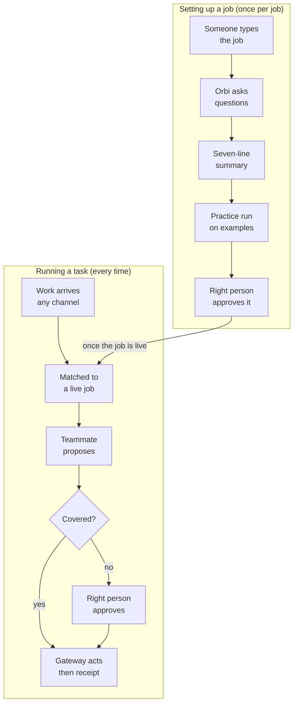
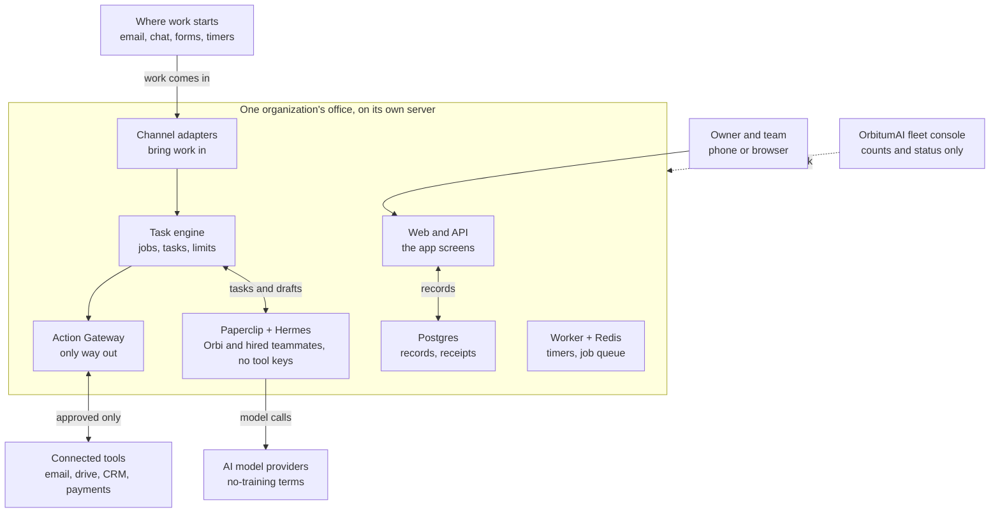
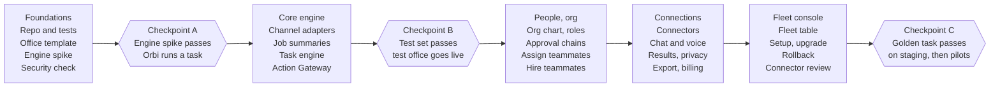

# ORBIT-OS PRD v9.0 — The AI Office for Any Organization

Oct 5, 2026 · Prepared by OrbitumAI · Product Owner: Shuv Chowdhury
Supersedes v8.0 (Oct 2, 2026). Internal name ORBIT-OS. Customer-facing name **Orbitcrew**.

---

## 1. Executive summary

v9.0 is a **clarification release**. The product is the same as v8.0: an organization gives work to a team of AI agents and people in plain English, and gets back done tasks, each with a receipt. No workflow canvas, no step builder, no template marketplace.

**Why this version exists.** v8.0 was read end to end by the build agent on 2026-10-05. That read produced one design collision that would have made roughly thirty screens wrong, seven contract corrections, five load-bearing items missing from the contract, and five open connector decisions. Every one of them traced back to the same root cause: **v8.0 states some rules in prose, some inside an open-decision table, and some nowhere at all, so anyone building from it has to guess.** v9.0 fixes that by moving every fixed list into one appendix, giving each role a screen inventory, and binding the design rules to the test file that already enforces them.

**What is new in product terms.** Three features only, all from the founder's stated intent on 2026-10-05: a User can request an AI teammate, an Org Admin approves that request and edits the teammate's prompt and guardrails, and an Org Admin assigns teammates to people and departments.

**What did not change.** The product definition, the six core ideas, the job and task engine, the approval model, the budget model, the architecture, the isolation rules and the fleet console are carried from v8.0 unchanged in substance.

**Honest warning, carried from v8.0 and still true.** Standing Authority (an AI teammate deciding inside limits a human set) is still **open-pending and blocks build**. v6.2's rule that an AI may never approve still stands until the founder answers. Turning loose plain English into safe, exact limits remains the hardest engineering problem in the product.

**Checklist for this document**

- [ ] Confirm the three new features in §8 and §9 (U-19, A-14, A-15).
- [ ] Answer open decision 2, Standing Authority. It blocks build.
- [ ] Decide the five connector decisions in §13. Safe defaults apply until you do.
- [ ] Confirm the first connector catalog in Appendix A.2.
- [ ] Confirm the real-data gate now has four conditions, not three (§14).
- [ ] Tell the build agent to rebase on v9.0 (Appendix C).

---

## 2. What changed from v8.0

v9.0 changes how the document states things, not what the product is. One row below is a scope change; the rest are corrections and clarifications.

| # | Area | v8.0 | v9.0 | Type |
| --- | --- | --- | --- | --- |
| 1 | Design rules | One table row inside the non-functional requirements (§15), with no link to the code that enforces them | Full section (§15) with the token source of truth named as `design/tokens.test.ts`, component rules, and a build check (S-43) | Clarification |
| 2 | Screens | No screen inventory for any role. The three dashboards existed only as prototypes | A screen inventory per role: User (§15.5), Org Admin (§15.6), Super Admin (§15.7), each mapped to feature IDs | Clarification |
| 3 | Roles | "Three kinds of person" and "four roles", with Org Admin appearing in both lists and Backup approver named only in an escalation rule | Access roles and authorities separated explicitly (§7.2), with Backup approver restored as a named authority | Correction |
| 4 | Teammate role names | "Report Writer" in the change table, "Operations Reporter" in A-10 and §7; Sales Analyst missing from one list | One fixed list of five, in Appendix A.1 only | Correction |
| 5 | Connector catalog | A prose sentence naming "accounting tools", plus a list that sits inside an **open decision** | A fixed catalog table in Appendix A.2, with the five open connector decisions restated and given safe defaults until answered | Correction |
| 6 | Declined requests | §6 and TASK-9 say a declined request writes a receipt; the open-items list says it is still undecided | Resolved: **a declined request always writes a receipt** | Correction |
| 7 | Customer wording | "Customer screens never say ORBIT-OS, Paperclip, Hermes or tokens" with no statement about the operator console | Scoped: customer screens follow the rule; the Super Admin fleet console is an internal operator surface and is exempt (§15.3) | Correction |
| 8 | Real-data gate | Settled decision 7 lists three conditions; the Anthropic terms condition sits separately in §14 and is in neither the gate nor the guard | Four conditions, stated once, in §14.3 | Correction |
| 9 | Fixed lists | Task states, risk categories, approval bases, the never-covers list and the budget triple are each stated once, in prose, in different sections | All of them in Appendix A, which is the only place they may be changed | Clarification |
| 10 | Requesting a teammate | A User can describe a job, but cannot request an AI teammate | U-19 User requests a teammate; A-14 Org Admin approves, edits the prompt and adds guardrails | **Scope change** |
| 11 | Assigning a teammate | No feature assigns a teammate to a person or department | A-15 Assign teammates | **Scope change** |
| 12 | Guided setup order | Name the organization, add departments, invite people, connect tools, give the first job | Create the org structure, create teammates, assign teammates to people, connect tools, give the first job (A-01) | **Scope change** |

**Explicitly unchanged from v8.0:** the product definition, §5 core ideas, §6 the job lifecycle, §11 the engine requirements (INT-1 to 5, JOB-1 to 9, TASK-1 to 9), §12 the approval and budget model, §14 the architecture, the isolation rules, §16 the non-functional targets, §17 the five build streams and three checkpoints, and the market and competitor assessment.

**Still out of scope** (declined earlier, not requested back): public self-signup, one shared platform for all customers, a template marketplace, a public API and SDK, white-label, Telegram, Google sign-in and passkeys, and any workflow canvas or step builder.

---

## 3. Market and competitors

Carried from v8.0 §3. Figures are analyst or vendor claims gathered on 2026-10-02, not audited numbers, and they disagree by roughly a factor of three.

**Market potential**

| Source | Estimate |
| --- | --- |
| MarketsandMarkets, via Toolradar | $7.84B in 2025 to $52.62B by 2030 (46.3% a year) |
| Grand View Research, via Toolradar | $10.9B in 2026 to $182.9B by 2033 (49.6% a year) |

Two facts matter more than the range. An SBE Council survey of 517 small employers found 82% have invested in AI tools. Gartner warns that over 40% of agentic AI projects are at risk of cancellation by 2027 on cost and unclear value. That second fact is the opening: buyers want agents and fear runaway cost and loss of control, which is exactly what budgets, approvals and receipts address.

**Competitors**

| Competitor | What it is | How ORBIT-OS differs |
| --- | --- | --- |
| Asana AI Teammates | AI agents inside Asana's task platform, positioned as the OS for human-agent teams | Strongest direct rival. Needs the customer to already run on Asana. ORBIT-OS works across any tools. |
| monday.com Digital Workers | AI agents inside monday.com | Same pattern: tied to one work platform. |
| Zapier Agents | Agents set up in plain English on top of Zapier's connections | Self-serve, built around the user's own apps. ORBIT-OS adds an org chart, approval authority and a dedicated office. |
| Relevance AI | Multi-agent "AI workforce" for sales and operations | Closest in idea, aimed at teams that build agents themselves. ORBIT-OS removes the builder. |
| Lindy | No-code agent builder for founders and small teams | Personal and build-it-yourself. ORBIT-OS is shared by the organization. |
| Microsoft 365 Copilot, Salesforce | AI built into suites people already use | Strong inside those suites. ORBIT-OS is neutral and simpler to start. |
| Claude Cowork, ChatGPT Agent | Agentic apps that help one person | Individual, not organizational. ORBIT-OS is the shared layer: who may approve what, budgets per agent, one audit trail. |
| Paperclip and Hermes used directly | The open-source parts ORBIT-OS is built on | The do-it-yourself alternative. ORBIT-OS adds the org chart, approvals, receipts and managed setup, and depends on them, so an upstream change is a risk. |

**Where ORBIT-OS can win** (assessment, to test with customers): authority built in, one isolated office per customer, plain English only, a budget per teammate with a receipt for every action, and managed setup.

**Where it is weak:** self-serve rivals start at roughly $20 to $80 a month; Asana, monday.com and Microsoft already own where work lives; managed setup and one server per customer cap growth (the ops trigger is 25 offices); and the category churns, with 28% of the 773 agent tools Toolradar tracks appearing in the last 90 days.

---

## 4. Goals, non-goals and success metrics

Carried from v8.0 §4. The one number on the wall is **hours given back per customer per week**.

**Goals**

- A new Org Admin gives the office its first job in plain English and confirms it in under 10 minutes.
- Every job is repeated back in plain words and tested on examples before it goes live.
- No outside action and no decision above a limit happens without a recorded person or a recorded Standing Authority.
- Every task has a receipt: what was done, why, who approved it, when, and the cost.
- An AI teammate that reaches its budget pauses alone; nothing else stops.
- An idle office makes no AI calls except Orbi's Friday review.
- Setup, upgrade, backup, restore and shutdown of an office are scripted or one-click.

**Non-goals:** any workflow canvas, step builder, flow editor or template marketplace; a shared platform where customers' data sits together; replacing the tools people already use.

**Success metrics** (targets proposed; confirm on the test office)

| Stage | Measure | Target |
| --- | --- | --- |
| Test office (OrbitumAI, founder holds every role) | Real jobs running across at least 3 departments | 5 or more |
| Test office | Decisions or sends with no recorded approval or Standing Authority | 0 |
| Test office | Jobs whose practice run matched what the owner meant | 90% or better |
| Test office | Idle model calls | 0, except the Friday review |
| Pilots | Time from sign-in to first confirmed job | Under 10 minutes |
| Pilots | Org Admins completing a live run within 24 hours | 50% |
| Pilots | New office set up with no manual steps | Under 15 minutes |
| Pilots | Teams with 2 or more people approving work | 50% within 30 days |
| Pilots | Override or edit rate over 4 weeks | Falling |
| Pilots | NPS | Above 40 |
| Business | Hours given back per customer per week | Estimated nightly; Vision target 10 hours at scale |
| Fleet | Unplanned upgrade rollbacks | 0 |
| Fleet | Operator time per office | Tracked monthly; add help at 25 offices or 10 hours a week for 4 weeks |
| **Build (new in v9.0)** | Screens failing the design and naming check (S-43) | 0 |

If a target is missed: a low practice-run match means the job-understanding step is fixed before more customers are added; a rising override rate means the teammate's instructions or limits are reviewed; any breach of a Standing Authority switches that authority off immediately until the cause is fixed.

---

## 5. Core ideas in plain words

Six ideas, and there is no seventh called a workflow.

| Idea | What it means | Example |
| --- | --- | --- |
| Job | A standing instruction written in plain English: what to watch for and what to do | "Approve expenses under $500 and send the rest to my CFO." |
| Task | One piece of work created when something triggers a job, or when a person asks | One expense request from Dana for $212 |
| Teammate | The person or AI agent who does a task. AI teammates are hired from ready-made roles | Finance Clerk (AI), or Priya, the CFO |
| Approval | A person's yes, or a Standing Authority a person granted with hard limits | The CFO approves the $1,800 request |
| Receipt | The record of what was done, why, by whom, approved by whom, when, at what cost | Receipt for the $212 approval |
| Office | One customer's private installation: its people, teammates, jobs, limits, connections | assistant.hartwell.example |

**Jobs are text, not diagrams.** A job has no steps to drag and no boxes to connect. A person writes it in everyday words, ORBIT-OS shows a plain summary of what it understood, and the person confirms it. Changing a job means changing its words and confirming again.

**The seven-line job summary.** Every summary has the same seven lines, so people learn to read it once:

1. **When:** what starts it.
2. **Who does it:** the AI teammate or person.
3. **What it may touch:** which connected tools it may read or change.
4. **Limits:** amounts, counts, hours, cost.
5. **Who approves:** the person, or the Standing Authority and its limit.
6. **If nobody answers:** the reminder and the person it moves up to.
7. **Examples:** exactly three real or made-up cases showing what would have happened.

**Example jobs, in an owner's own words** (range, not templates):

| Department | Job |
| --- | --- |
| Finance | "Approve expenses under $500 and send the rest to my CFO." |
| Sales | "When a new lead emails, send a short thank-you and draft a reply for me to approve." |
| Support | "Sort customer questions into billing, technical or other, and flag anyone who sounds angry." |
| HR | "Collect candidate availability and put interviews on the hiring manager's calendar." |
| Operations | "Every Friday, write a one-page summary of what the team shipped and what is late." |

---

## 6. How a plain-English job becomes done work

A job is checked before it goes live, and every task it creates is checked again before anything leaves the office.



"Covered" means a Standing Authority that a Leader granted covers this exact kind of action, within its limit. If it is not covered, a person approves. **A declined request closes the task and writes a receipt** (resolved in v9.0; see §2 row 6).

**What keeps this safe**

- **Orbi never guesses.** A gap in a job gets a question, not an assumption.
- **The practice run touches nothing.** It uses examples and shows what would have happened.
- **The right person activates the job.** Nobody can activate a job needing more authority than they hold.
- **Limits are numbers, enforced by code.** The AI proposes. Fixed checks decide what is allowed.
- **One gate out.** Only the Action Gateway sends anything outside the office, and it refuses any action with no valid approval or covering Standing Authority.

---

## 7. Users, access roles, authorities and the AI team

This section is rewritten. v8.0 listed "three kinds of person" and "four roles" with Org Admin in both lists, and named Backup approver only inside an escalation rule. That ambiguity produced a build question about whether the product has an access-plus-authority split or four flat roles. **It has the split.**

### 7.1 Access roles — what you can see and reach

One per person per office. This is the sign-in level.

| Access role | What they reach | Where |
| --- | --- | --- |
| User | Home, task board, their tasks, receipts, team, reviews, chat | The app, phone or desktop |
| Org Admin | Everything a User reaches, plus Setup, Departments, People, Teammates, Jobs, Rules, Spending, Connections, Data | The same app |
| Super Admin | Every customer's office at the operations level, counts and status only, never customer content | The fleet console, over OrbitumAI's private network |

### 7.2 Authorities — what you may approve

Separate from access role. A person may hold none, one or several. In a small firm the owner often holds all four. **Authority is checked at the moment of each decision and recorded with it.**

| Authority | What it approves |
| --- | --- |
| Leader | Big decisions: money above a limit, commitments, legal, people matters. Grants Standing Authority. |
| Approver | Everyday work inside their department. |
| Backup approver | Receives a request after the escalation interval when the Approver has not answered. |
| Budget holder | Higher spending limits for AI teammates and connectors. Defaults to the Leader. |

**Office-change approvals** (new job, new rule, costly hire, Standing Authority, budget increase) are routed by type to the Org Admin access role, a Leader, or a Budget holder. The Org Admin access role carries office-change approval for the types in §12, and nothing above it.

**Fixed rules**

- Every office keeps at least one Org Admin and one Leader. A pending Leader invitee counts, but high-risk requests are held until they accept.
- Granting Leader or Budget holder, or reducing a Leader's authority, creates a request an existing Leader must confirm. An Org Admin's attempt creates a request, not a change.
- The Super Admin never holds an authority inside a customer office. Support access is a logged "view as customer" session the owner allowed.

### 7.3 Org structure

An office has departments (for example Sales, Finance, Support, HR, Operations), teams inside them, and reporting lines. People and AI teammates both appear on the chart. **Each job belongs to exactly one department, and each department has a default Approver and an escalation path.**

### 7.4 The AI team

AI teammates are not people. Each has a role, a budget (three numbers, Appendix A.5), a list of tools it may use, an assignment, and a record of what it has done.

- **Orbi, the Coordinator.** Exactly one per office, always present, never removable. Orbi turns what people type into job summaries, asks questions when a job is unclear, triages tasks that match no job, takes over stuck tasks, writes the Friday review, and answers in chat.
- **Hired teammates.** An Org Admin hires them from the fixed list of five ready-made roles in **Appendix A.1**. Which tools each may use is set when it is hired and checked by code, not by the AI.
- **A teammate cannot grant itself anything.** More tools, a bigger budget or a wider Standing Authority always need a human decision.

Intake and sending are done by ordinary software, not by an AI teammate: channel adapters bring work in, and a single Action Gateway carries every outside action out (§14).

---

## 8. User features

A User can give work in plain words, approve work in under a minute from a phone, and always see what was done in their name. Status: **Kept** = carried from v7.0 or v8.0, **Reworked** = changed in v8.0 to fit tasks, **New v9** = added in this version.

**Getting in**

| ID | Feature | In plain words | Status |
| --- | --- | --- | --- |
| U-01 | Email sign-in link | No password. A link in your email signs you in; it works once and expires in 15 minutes. | Kept |
| U-02 | 30-day session | You stay signed in for 30 days. Risky actions ask for a fresh sign-in if it has been over a day. | Kept |
| U-03 | Password and authenticator code | Optional password plus a code from an authenticator app. | Kept |
| U-04 | Face ID or Touch ID | Confirm an approval with your face or fingerprint (open decision 4). | Kept |

**Giving work**

| ID | Feature | In plain words | Status |
| --- | --- | --- | --- |
| U-10 | Ask for one task | Type or speak what you need, such as "book the March team dinner under $600". Orbi creates the task and tells you who has it. | Kept |
| U-11 | Describe a standing job | Write a job in everyday words. If it needs a bigger person's approval, it goes to them. | Kept |
| U-12 | Check the job summary | Orbi repeats back what it understood in seven plain lines and asks questions if anything is unclear. You approve, edit or cancel. | Kept |
| U-13 | Practice run | See what the job would have done on real or made-up examples before it goes live. | Kept |
| U-14 | Forward or upload | Forward an email or upload a file to start a task. | Kept |
| U-15 | Task board | Three lists: waiting for me, assigned to me, I asked for. | Kept |
| U-16 | Task page | What the task is, who has it, status, evidence, history and receipt. | Kept |
| U-17 | Comment or ask Orbi | Add a note to a task, or ask Orbi "where is this?" | Kept |
| U-18 | Cancel or reassign | Stop a task, or move it to another person or AI teammate within your authority. | Kept |
| **U-19** | **Request an AI teammate** | Ask for a teammate you need, in plain words: what it would do, for which department, and why. It goes to the Org Admin as a request (A-14). You see its status and who has it. You cannot create a teammate yourself. | **New v9** |

**Approving**

| ID | Feature | In plain words | Status |
| --- | --- | --- | --- |
| U-20 | Waiting for you | Things that need you, oldest first, each with a countdown to expiry (72 hours). | Kept |
| U-21 | Approval page | The request, the evidence, and exactly what happens if you approve. Nothing happens until you press a button. | Reworked |
| U-22 | Edit before approving | Change the proposed action, wording or amount on the page. Both versions are saved on the receipt. | Kept |
| U-23 | Decline with a reason | Decline and say why. **A declined request still writes a receipt.** | Kept |
| U-24 | Six safe states | Clear screens for: expired, already decided, request changed, sending or failed, office paused, not yours. | Kept |
| U-25 | Ask the leader | If a request is above your level, one tap sends it to a Leader with a note. | Kept |
| U-26 | Snooze | Hide a request until a time you pick. The expiry clock keeps running. | Kept |
| U-27 | Undo | Exactly 30 seconds to stop an outside action before it goes out. | Kept |
| U-28 | I'm away and delegation | Hand your approvals to someone you choose, for a set time, with a log. | Kept |

**Staying informed**

| ID | Feature | In plain words | Status |
| --- | --- | --- | --- |
| U-30 | Home | Waiting for you, today's work in one line, recent receipts, last week's review. | Reworked |
| U-31 | Receipts | One for every action: what was done, why, who approved, times, cost. | Reworked |
| U-32 | Email alerts | A short email when something waits for you. Never contains private details. | Kept |
| U-33 | Phone push alerts | The same alerts as phone notifications. | Kept |
| U-34 | Lock-screen actions and widget | Open or snooze from the notification. A Home Screen widget shows the waiting count (open decision 5). | Kept |
| U-35 | Why did it do this? | Shows what the teammate used: the request, the job's words, the facts file. | Reworked |
| U-36 | Weekly reviews | Every Friday review, not only the newest. | Kept |
| U-37 | Search | Search tasks and receipts by words, person, date or department. | Kept |
| U-38 | Hours given back | An estimate of time saved, on Home and in the review. | Reworked |

**Talking to Orbi**

| ID | Feature | In plain words | Status |
| --- | --- | --- | --- |
| U-40 | Chat with Orbi | Ask in plain words: "what is waiting?", "what did Finance approve today?" Orbi answers only from data you may see. | Kept |
| U-41 | Voice | Speak to Orbi instead of typing. | Kept |
| U-42 | Light and dark mode | Follows the phone setting. | Kept |

**User total: 35 features.**

---

## 9. Org Admin features

The Org Admin builds the organization inside the product, hires and assigns AI teammates, approves the jobs and teammates people ask for, and sets every limit, without asking OrbitumAI for help except for server-level work.

**Setup and structure**

| ID | Feature | In plain words | Status |
| --- | --- | --- | --- |
| A-01 | Guided setup | A checklist with a progress bar, in this order: **1** name the organization and create departments and teams, **2** invite people and set roles, **3** create (hire) AI teammates, **4** assign teammates to people and departments, **5** connect the tools those teammates need, **6** give the first job. | **Reworked v9** |
| A-02 | Departments and teams | Create departments and teams, each with a default Approver and an escalation path. | Kept |
| A-03 | Org chart editor | Drag people and AI teammates into place to show who reports to whom. | Kept |
| A-04 | Invite people | An invitation that works once and expires in 7 days. | Kept |
| A-05 | Roles and authorities | Set each person's access role (User or Org Admin) and their authorities (Leader, Approver, Backup approver, Budget holder). Authority is checked at the moment of each decision. | **Reworked v9** |
| A-06 | Backups and escalation | Name a Backup approver for each Approver. If nobody answers, work moves up the chain (2 hours, 2 hours, then 24 hours; editable). | Kept |
| A-07 | Delegation and role requests | Approve a delegation or a request for a bigger role, with an end date. | Kept |
| A-08 | Empty Leader rule | If the Leader seat is empty, a stated fallback applies and high-risk work is held. | Kept |

**AI teammates**

| ID | Feature | In plain words | Status |
| --- | --- | --- | --- |
| A-10 | Hire AI teammates | Pick a ready-made role from the fixed list (Appendix A.1), set its budget, and see it join the chart. | Kept |
| A-11 | Teammate profile | One page per teammate: role, prompt, guardrails, tools, limits, assignment, jobs, cost and full record. | Kept |
| A-12 | Pause or retire a teammate | One switch pauses it; retiring keeps its record. | Kept |
| A-13 | Tool permissions | Choose which connected tools each teammate may read or change, action by action. | Kept |
| **A-14** | **Teammate requests** | A queue of teammate requests from Users (U-19). The Org Admin approves, edits the teammate's prompt, adds guardrails (tools, limits, data boundary, department), or declines with a reason. A request never creates a teammate on its own. Costly hires follow the office-change rule (A-34). | **New v9** |
| **A-15** | **Assign teammates** | Assign a teammate to a department, a team, or named people, and set who its default Approver is. A teammate with no assignment cannot be given work. | **New v9** |

**Jobs**

| ID | Feature | In plain words | Status |
| --- | --- | --- | --- |
| A-20 | Jobs library | Every standing job in plain English with status, owner, department, last run and cost. | Kept |
| A-21 | Job review | Approve, edit or retire jobs people described. Nothing goes live until the right person approves. | Kept |
| A-22 | Job limits | Set amounts, counts, hours and cost limits on a job. Code enforces them. | Kept |
| A-23 | Standing Authority | A Leader lets a teammate decide inside a numeric limit with an end date. **Feature-flagged off and read-only until open decision 2 is answered.** | Kept, blocked |
| A-24 | Job history | Every wording change, who approved it and when, with the option to go back. | Kept |
| A-25 | Starter phrases | Example job sentences per department. Examples, not templates. | Kept |
| A-26 | Conflict check | Warns when two jobs claim the same kind of work, and blocks activation until a person resolves it. | Kept |
| A-27 | Practice mode | Run any job on made-up or past examples without touching real tools. | Kept |

**Control and safety**

| ID | Feature | In plain words | Status |
| --- | --- | --- | --- |
| A-30 | Pause the whole office | One switch stops all new work and all outside actions. | Kept |
| A-31 | Pause one job | Stop a single job without touching the rest. | Kept |
| A-32 | Rules | Simple rules such as "anything over $500 needs the CFO." Rules may only add caution, never remove it. | Kept |
| A-33 | Rule suggestions | The system proposes a rule after repeated overrides; you accept or reject. | Kept |
| A-34 | Office-changes approval | Changes to rules, costly hires, Standing Authority and budget raises need a named approver. | Kept |
| A-35 | Activity log | A readable list of who approved what, using which authority. | Kept |
| A-36 | Business and quiet hours | When alerts may reach people and when outside actions may go out. | Kept |
| A-37 | VIP and never-touch lists | People or senders always handled by a person, or never touched. | Kept |
| A-38 | Data boundaries | Which department's data each teammate may see. | Kept |
| A-39 | Reconnect a tool | If a connected tool signs you out, the affected jobs pause and a button reconnects it. | Kept |

**Spending**

| ID | Feature | In plain words | Status |
| --- | --- | --- | --- |
| A-40 | Spending view | Spend against limit for the company, each teammate, each connector and each job. | Reworked |
| A-41 | Budget warnings | A warning at 80% and a pause at 100%, per teammate. | Kept |
| A-42 | Change limits | Raise or lower limits; raising needs the Budget holder. | Kept |
| A-43 | Plan and invoices | See your plan, upgrade it, download invoices. | Kept |
| A-44 | Cost per job and task | What each job and each task cost. | Kept |
| **A-45** | **Teammate performance** | A per-teammate tab on Results: runs over 7 days with a trend, success rate, average time, how often people edited the work, cost over 7 days and cost per run, sortable, with a needs-attention mark below 90% success or at or above 40% edited. Row opens the teammate profile. | **New v9, added 2026-10-06** |

**Connections and data**

| ID | Feature | In plain words | Status |
| --- | --- | --- | --- |
| A-50 | Connections screen | See and manage every connected tool (§13). | Reworked |
| A-51 | Intake channels | Which inboxes, chats, forms and schedules may create tasks. | Kept |
| A-52 | Results page | Tasks done, hours given back, override rate, cost per job. | Reworked |
| A-53 | Privacy page | What the AI saw and where it went. | Kept |
| A-54 | Export and delete | Download all receipts and data, or delete the office, completed within 30 days. | Kept |
| A-55 | Optional training data | Share redacted examples to improve the product. Off unless you agree. | Kept |
| A-56 | Connections belong to the business | If the person who connected a tool leaves, the connection stays and is reassigned. | Kept |

**Org Admin total: 45 features.**

---

## 10. Super Admin features

The Super Admin runs every customer's office from one console and can prove no office leaks into another. The console shows counts and status only, never a customer's tasks, emails or documents. Access is OrbitumAI staff over a private network, with two-step sign-in. Connector controls are in §13.

**Running the fleet**

| ID | Feature | In plain words | Status |
| --- | --- | --- | --- |
| S-01 | Set up a new office | Six facts in; the office runs in under 15 minutes with no manual steps. | Kept |
| S-02 | Setup tracker | Each new customer's step and where it is stuck. | Kept |
| S-03 | Upgrade | Maintenance notice, backup, apply, security check, test, then done or roll back within 10 minutes. | Kept |
| S-04 | One-click rollback | Return an office to the previous version. | Kept |
| S-05 | Upgrade calendar | One upgrade day per month, with automatic notice. | Kept |
| S-06 | Test office | A staging office tries every new version first. | Kept |
| S-07 | Backup and restore | Nightly backups kept 30 days, restore to the same or a new server, monthly practice restore. | Kept |
| S-08 | Pause, pause all | Pause one office or all of them. | Kept |
| S-09 | Shut down an office | Needs the customer's written request and the owner's confirmation. Export first, deletion after 30 days. | Kept |
| S-10 | Fleet console | Every office with health, versions, backups, team status, connections, incidents, requests waiting over 24 hours, spend this month, operator minutes. | Kept |

**Safety and trust**

| ID | Feature | In plain words | Status |
| --- | --- | --- | --- |
| S-20 | Security check | After every setup and upgrade: no public ports, engines hold no tool keys, every outside action passes the Action Gateway, versions match. A failure blocks "healthy". | Reworked |
| S-21 | Alerts | Emails when a server is down, a backup is missed or an outside action fails. | Kept |
| S-22 | AI provider outage warning | Flags offices affected when the AI provider is down. | Kept |
| S-23 | Operator audit | Every operator action logged inside the affected office, where the owner can read it. | Kept |
| S-24 | Two-step sign-in for operators | Required for the console and the engine screens. | Kept |
| S-25 | View as customer | A support view the owner must allow, with a visible banner and a log. | Kept |
| S-26 | Status page and incident log | A public status page and a private incident list. | Kept |
| S-27 | Evidence pack | A ready set of security and privacy proof for customers who ask. | Kept |

**Money and quality**

| ID | Feature | In plain words | Status |
| --- | --- | --- | --- |
| S-30 | Operator time tracking | Minutes per office each month. Add help at 25 offices or over 10 hours a week for 4 weeks. | Kept |
| S-31 | Cost analytics | Spend by office, teammate and AI model. | Kept |
| S-32 | Profit per customer | What each customer pays against what they cost to run. | Kept |
| S-33 | Job quality scoreboard | Per office: practice-run match rate and override rate, trending. | Reworked |
| S-34 | Skills review queue | Review any new skill a teammate proposes before it can be used. | Kept |
| S-35 | Teammate role library | Manage the ready-made roles customers hire from (Appendix A.1) and the starter phrases per department. | Reworked |
| S-36 | Overrides | Change a limit or setting for one office with a logged reason. | Kept |
| S-37 | Settings panel | Per-office settings with a Test connection button for the engine, the Action Gateway, intake channels and email. | Kept |
| S-38 | Nightly numbers | Each office sends numbers only to the fleet database. | Kept |

**Quality gates**

| ID | Feature | In plain words | Status |
| --- | --- | --- | --- |
| S-40 | Job-understanding test set | A fixed set of example jobs re-run before any prompt or model change. | Kept |
| S-41 | Standing Authority watch | How many are active across offices, how often used, and any breach that switched one off. | Kept |
| S-42 | Model routing and usage | Which AI model handles which part of the work, and the cost of each. | Kept |
| **S-43** | **Design and naming check** | A build check that fails if a customer screen uses a colour outside the token set, a card grid where §15 requires a plain list, or the words ORBIT-OS, Paperclip, Hermes, MCP or token. Runs with S-20 and in CI. | **New v9** |

**Super Admin total: 31 features.**

---

## 11. Job and task engine requirements

Carried from v8.0 §11 unchanged. A model may help understand and draft; **fixed code decides what is allowed.**

**Bringing work in**

- **INT-1 Channels:** email, chat message, form link, a person in the app, a forwarded email or uploaded file, a schedule, or an event from a connected tool. Each channel is a separate adapter, so adding one never changes the engine.
- **INT-2 Hostile input:** everything arriving is treated as hostile. Rules strip signatures and quoted history, drop receipts, newsletters, codes and password resets, and cut long text before any AI sees it.
- **INT-3 No duplicates:** the same item never creates two tasks; later messages in a thread follow the rules of the job that owns it.
- **INT-4 Matching:** each item is matched to a job by words, sender, channel and department. No match becomes an unmatched task for Orbi to triage. Orbi may ask a person and never guesses on money, commitments, legal or people matters.
- **INT-5 Known sources:** a person or sender the office already works with follows the job's rules for known sources.

**Understanding a job**

- **JOB-1 Plain English only:** no step editor, canvas or flow builder, and none may be added.
- **JOB-2 Questions first:** up to three short questions at a time. Never fill a gap with a guess.
- **JOB-3 Seven-line summary:** fixed code, not the model, turns the summary into the exact limits the engine enforces.
- **JOB-4 Honest refusal:** say plainly when a job cannot be done safely or with the connected tools, and why.
- **JOB-5 Practice run:** before activation, on real past items or made-up ones, with no outside action.
- **JOB-6 Activation needs the right person:** otherwise it goes to a Leader or Approver.
- **JOB-7 Versions:** every wording change is a new version and needs approval again. Old versions stay in the history.
- **JOB-8 No overlaps:** two active jobs may not claim the same trigger without a clear order.
- **JOB-9 Retire and pause:** open tasks from a retired job are finished or reassigned by a person.

**Doing a task**

- **TASK-1 States:** the seven states in Appendix A.3. Each change is recorded.
- **TASK-2 Assignment:** the job names the teammate or person. A person may reassign within their authority.
- **TASK-3 Evidence:** the teammate attaches the request, the job's words, facts it read, and what it proposes.
- **TASK-4 Risk category:** fixed checks set the category (Appendix A.4) from amounts, words, recipients and the tool. A model may raise a category, never lower it.
- **TASK-5 Sub-tasks:** only inside the job's limits and only for teammates or people the job allows.
- **TASK-6 Time and escalation:** reminder at 2 hours, expiry at 72 hours by default, editable per job.
- **TASK-7 Stuck tasks:** a stalled task, or a teammate returning a broken result twice, goes to Orbi and the daily digest.
- **TASK-8 Never lost:** every pending step is a database row. Redis only runs jobs; a check every minute re-queues anything it lost.
- **TASK-9 Receipts:** every finished, failed, cancelled **or declined** task writes a receipt.

---

## 12. Approvals, Standing Authority, budgets and cost

Nothing consequential happens without a recorded person or a recorded Standing Authority a person granted, and the AI may only make the rules stricter, never looser. This is the single place the approval rules are stated.

**Three kinds of approval** (fixed list, Appendix A.6)

- **Per-action approval:** a person says yes to one specific action, tied to one task and one decision.
- **Standing template approval:** a person approves a fixed piece of text once. Only that exact text may go out under it; any wording change needs approval again.
- **Standing Authority:** a Leader lets an AI teammate decide inside hard limits. **Open decision 2. Not approved for build.**

**How Standing Authority is kept safe** (design, not yet approved)

- A Leader grants it in writing, and the grant names the teammate, the category, a **numeric** limit (amount, count per day, or both), and an end date.
- Fixed code enforces the limit, not the AI. A request over the limit, or in another category, goes to a person automatically.
- Every use is recorded with the grant it relied on and the person who granted it.
- Any breach, or a use a person marks "wrong", switches that authority off at once and alerts the Leader. Switching it back on is manual.
- It never covers the fixed list in Appendix A.7.
- It is deciding only. Moving money out of the organization is a separate outside action.

**Who approves what**

| Kind of work | Who approves | If nobody answers |
| --- | --- | --- |
| Routine, inside a department | Approver, or anyone above, or a Standing Authority | Reminder at 2 hours, then the Backup approver, then escalate |
| Decline or refer | Approver, or anyone above | Same |
| High-risk: money above a limit, commitments, legal, people matters, more than one outside recipient | Leader | Escalate up the chain; expires at 72 hours if still silent |
| Office change: new job, new rule, costly hire, teammate request, Standing Authority, budget increase | Org Admin, Leader or Budget holder, by type | Stays open and is listed in the digest |

**Outside actions.** Anything leaving the organization goes through the Action Gateway (§14). The gateway refuses any outside action with no valid approval ID, no valid standing template approval, and no valid Standing Authority covering it. A 30-second undo window applies to every outside action a person approved.

**Rules that never change**

- The category is the most sensitive of the teammate's flags and the fixed checks.
- Authority is checked at the moment of decision and recorded with it.
- The first valid decision wins. A second attempt sees "already decided."
- Approval links are signed, work once, are tied to one decision and expire with the request. Opening one never acts.
- High-risk actions need a sign-in under 24 hours old.
- AI teammates cannot approve outside a Standing Authority, cannot widen their own tools, and cannot change a limit.
- Board actions on the AI engine run through ORBIT's service account only after the matching human decision is recorded.

**Budgets.** Each teammate has the three numbers in Appendix A.5. At 80% the owner is warned; at 100% that teammate pauses and nothing else does. A paused teammate's tasks go to Orbi; if Orbi is paused too, they wait with a digest entry. Each connector has its own daily call and cost limit. An idle office makes no AI calls except Orbi's Friday review.

**Cost records.** Every AI call is logged with model, tokens, cost, time and result. Receipts, spending screens and the cost-per-job view read from that log.

**Pricing.** The office is priced as one unit. Before the first customer is quoted, a unit-economics sheet must show a positive margin per plan using the measured server size and AI cost. Price and setup fee are open decision 9.

---

## 13. MCP connectors: who adds and manages them

The Org Admin adds and removes connectors for their own office, OrbitumAI controls which connectors are allowed at all, and no connector can act in the organization's name without the normal approval.

**Who can do what**

| Action | User | Org Admin | Leader | Super Admin |
| --- | --- | --- | --- | --- |
| See which connectors are on and their status | Yes | Yes | Yes | Counts only |
| Add an approved connector that only reads | No | Yes | Not needed | No |
| Add an approved connector that can change things | No | Proposes | Approves | No |
| Request a custom connector (customer's own server) | No | Yes | Approves | Reviews |
| Pause or remove a connector in the office | No | Yes | Yes | Emergency pause only |
| Change which actions a connector may do | No | Proposes | Approves | No |
| Add, approve, retire or block a connector for all offices | No | No | No | Yes |
| Block a connector in one office | No | No | No | Yes, logged |

**Two tiers.** The **approved catalog** holds connectors OrbitumAI reviewed and pinned to a version (Appendix A.2). A **custom connector** is the customer's own MCP server; it cannot go live until the Super Admin reviews it, and it starts read-only.

**Org Admin features**

| ID | Feature | In plain words |
| --- | --- | --- |
| C-01 | Connections screen | Every connector with status, who connected it, last used, which teammates and jobs use it, what it can read or change. |
| C-02 | Browse the catalog | Pick from approved connectors, each with a plain-words description. |
| C-03 | Add a connector | Choose it, sign in with the provider, review permissions, get the approval, run a test, switch it on. |
| C-04 | Permission review | Every action shown as "can read" or "can change things." Tick the ones you allow. **Everything starts read-only.** |
| C-05 | Approval for changes | An action that sends, pays or changes something runs only under an approval or a covering Standing Authority. |
| C-06 | Pause or remove | One switch pauses. Removing revokes and deletes the sign-in. |
| C-07 | Request a custom connector | Server address, purpose, who runs it. Goes to the OrbitumAI review queue with a visible status. |
| C-08 | Connector activity | What each connector read or did, when, for which task, approved by whom. |
| C-09 | Connections belong to the business | If the person who connected it leaves, the connection stays and is reassigned. |
| C-10 | Sign-in expiry alerts | A warning before a sign-in expires, with a Reconnect button. Dependent jobs pause if it lapses. |
| C-11 | Per-connector limits | Daily call and cost limits per connector, with the 80% warning and 100% pause. |

**Super Admin features**

| ID | Feature | In plain words |
| --- | --- | --- |
| C-20 | Connector catalog | Add, approve, retire and pin a version. Every tool marked read or change. |
| C-21 | Custom connector review queue | Who runs the server, what data goes there, the tool list, a staging test. Approve for one office, approve for the catalog, or reject with a reason. |
| C-22 | Per-office switches | Enable, disable or block a connector for one office, with a logged reason. |
| C-23 | Change watch | If a connector adds or changes a tool, it pauses in every office until re-reviewed. |
| C-24 | Connector health | Status counts per connector across offices, never customer content. |
| C-25 | Revoke everywhere | If a provider is compromised, revoke and rotate its sign-ins in all offices at once. |
| C-26 | Gateway rules | Allowed destinations, rate limits and size limits, tested in CI. |

**Safety rules built into every connector**

- **C-30 Gateway only:** every connector call goes through the Action Gateway. AI teammates never hold a sign-in token and never talk to a connector directly.
- **C-31 Results are untrusted:** whatever a connector returns is treated like a hostile email. It cannot raise permissions, trigger an action or change an approval.
- **C-32 Privacy page:** A-53 lists every connector that can see data and what it may receive.
- **C-33 Same approval rule:** the test that blocks any outside action without a valid approval also covers every connector action that changes something.

### 13.1 Open connector decisions (founder to answer)

These five were open in v8.0 and remain open. **Until each is answered, the safe default in the last column applies, and the contract must encode the default, not the suggestion.**

| # | Decision | Suggestion | Safe default until answered | Blocks |
| --- | --- | --- | --- | --- |
| CD-1 | Can a customer add their own MCP server at all? | Yes, after Super Admin review, read-only by default | Custom connectors disabled; C-07 shows "coming soon" | C-07, C-21 |
| CD-2 | Who reviews a custom connector, and how fast? | The Super Admin, with a target answer time you set | No published target time | C-21 |
| CD-3 | Do connector costs count against the AI budget or their own? | Their own budget per connector (C-11) | Own budget per connector | C-11, A-40 |
| CD-4 | Which connectors are in the first catalog? | Email, Calendar, Drive, Slack, HubSpot, Stripe, Notion, then WhatsApp once Meta approves | Appendix A.2 as written | A-50, C-02, all seed data |
| CD-5 | Does a Leader approve every change-capable connector, or only above a risk level? | Every one, until you have seen how often it happens | Every one | C-03, C-04 |

---

## 14. Architecture, data, security and compliance

Every customer gets a complete, separate office on its own server, and every action that leaves the office passes through one gate that checks for approval.



### 14.1 How the office is built

- **One office per customer:** web, API, worker, channel adapters, task engine, Action Gateway, Redis, Paperclip, Hermes and one Postgres server with two databases (orbit and paperclip) and separate logins. Nothing shared.
- **Action Gateway:** the single piece of code holding connector sign-ins and sending outside actions. It refuses any action with no valid approval, standing template approval or Standing Authority.
- **Own address:** each office lives on `assistant.<customer-domain>` through a CNAME the customer adds. Certificates are automatic.
- **Same recipe every time:** offices built from one versioned template; only settings and secrets differ.
- **OrbitumAI operates it:** customers never touch servers, containers or engine screens. Engine screens are reachable only over OrbitumAI's private network.
- **Pending work lives in the database:** Redis only runs jobs; a check every minute re-queues anything lost.
- **Client-hosted offices:** the same template can run on a customer's own server under contract (Enterprise tier). Not at launch.

### 14.2 Keeping customers and teammates apart

- No database, queue or AI engine port is open to the internet.
- The AI engine runs in its own container with no connector sign-ins, no email keys and a read-only disk.
- Only the Action Gateway can send anything outside. **A software test fails the build if any other program gains that power.**
- Each teammate sees only the departments the Org Admin allows (A-38).
- Each request or task gets its own AI session. AI memory is off. Sessions are deleted at 90 days.

### 14.3 The real-data gate — four conditions

**Changed in v9.0.** v8.0 recorded three conditions in its settled decisions and stated the Anthropic condition separately in the architecture section, so it reached neither the decision log nor the guard. All four are now stated once, here.

No live inbox, real mailbox or real customer data in any environment until **all four** are met:

1. The **Action Gateway** exists and passes its tests.
2. The **audit log** exists and passes its tests.
3. **Budget pausing** exists and passes its tests.
4. **Anthropic's no-training and zero-retention terms are confirmed in writing**, recorded in an attestation file the guard reads (`docs/gates/anthropic-terms.md`) naming who confirmed it, when, and where the signed document lives.

Until all four are met, OrbitumAI's own test office runs on a **dedicated test mailbox and test accounts only**. When all four are met the founder is told, and **the founder decides** when real data is used, not the code. Tracked in `docs/decisions.md` and enforced by `guards/standing-rules.test.ts`.

Condition 4 differs from the others: it is a contract to request and sign, not code to write. Requesting it is the founder's task and has the longest lead time of anything in this plan. The request must name every API organization the product will use, and ask for: ZDR approval, which planned models are Covered Models and what retention applies to them, which API features are ZDR-eligible, and the no-training commitment in the commercial agreement.

### 14.4 What the AI can see, and data retention

- Text is cut and cleaned before any AI call. The size limit is open decision 11.
- The Privacy page lists every kind of AI call and every connector that sees data.

| Data | Kept for |
| --- | --- |
| Raw incoming text and AI session files | 90 days |
| Redacted event and cost records | 24 months |
| Receipts and job history | For the life of the customer |
| Backups | 30 days |

Expired data is removed automatically each night from settings, not from code. Customers can export everything and ask for deletion, completed within 30 days.

**Secrets.** Connector tokens are encrypted with a per-office key and never reach prompts, logs, AI containers or the browser. A rotation runbook exists.

**Data that leaves an office.** Only: the nightly numbers rollup, calls to AI providers, approved outside actions through the Action Gateway, and exports delivered to the customer.

---

## 15. Design, naming and screens

**New section in v9.0.** v8.0 carried the design rules as a single row inside the non-functional requirements table and named no source of truth. The build agent's plan therefore said to copy the prototype's tokens, which are purple `#6316F9`, pink `#E94BB5`, canvas `#F3F2F8`, radii 18/12/8, with KPI tiles, agent cards and a template grid. That contradicts the design rule on colour, on layout and on the palette the repo already tests. Roughly thirty screens would have been built wrong. This section exists so that cannot happen again.

### 15.1 Design tokens — one source of truth

- The **frozen `design/` package is the source of truth**, and `design/tokens.test.ts` is the test that proves it. Its cases already assert that light tokens match UX-1 exactly and that text colours reach 4.5:1 on paper and canvas in both themes (UX-7).
- The prototype at `reference/orbit-os-frontend/` is the source of truth for **behaviour, copy and screen flow only**. Its colours, radii and card layouts are v7.0-era inventions and are not carried over.
- Where the two disagree on anything visual, `design/` wins, with no exceptions and no per-screen judgment.
- A screen may not introduce a colour, radius, spacing step or font that is not in the token set. S-43 fails the build if one does.

### 15.2 Component rules

| Rule | Detail |
| --- | --- |
| Colour | Black and white. One red, used only for errors. No second accent colour. |
| Type | Inter. Body text at least 16 px. |
| Lists | Plain lists. **No card grids, no KPI tiles, no template gallery.** A list row may carry a label and a number; it may not become a tile. |
| Theme | Light and dark follow the phone setting. |
| Buttons | At least 44 px; Approve at least 48 px. |
| Contrast | At least 4.5:1, verified by the token tests. |
| Zoom and keyboard | Works at 200% zoom, keyboard reachable everywhere, status changes announced. Automated check shows zero serious issues. |

### 15.3 Naming rules, and what is exempt

| Surface | Rule |
| --- | --- |
| User app and Org Admin app (customer screens) | Say **Orbitcrew**, **Orbi** and the teammate names. **Never** ORBIT-OS, Paperclip, Hermes, OpenClaw, MCP, token, agent id or adapter name. This includes the `<title>` tag, email subjects, push alerts and error text. |
| Super Admin fleet console | **Exempt.** It is an internal operator surface, not a customer screen. ORBIT-OS, Paperclip, Hermes, runtime ids and adapter names are correct there. |
| Emails and push alerts to customers | Customer rule applies, and they carry no private details. |

**Where the title rule applies.** Amended 2026-10-06. It governs the entry files Stream A creates under `dashboards/`:

| Entry | Title |
| --- | --- |
| `dashboards/user/index.html` | says **Orbitcrew**, never ORBIT-OS |
| `dashboards/org-admin/index.html` | says **Orbitcrew**, never ORBIT-OS |
| `dashboards/fleet/index.html` | keeps **ORBIT-OS**, under the exemption above |

It does **not** apply to `reference/orbit-os-frontend/`. The earlier wording asked for the three prototype entry files to be corrected, which was wrong on reflection: the prototype is the behaviour and copy spec, it is read-only, and editing it would make the spec disagree with the artifact it documents. Its titles stay as they are, and nobody ships them.

Enforced by S-43, which scans the customer surfaces and the three `dashboards/` entry titles, and excludes `reference/`.

### 15.4 Shared screen states

Every list and detail screen implements all six, using the same copy pattern:

| State | Rule |
| --- | --- |
| Empty | Say what will appear here and the one action that fills it. Never an illustration. |
| Loading | Skeleton rows matching the list, not a spinner. |
| Error | Plain sentence, the one red, and a retry. Never an error code on a customer screen. |
| Office paused | Banner on every screen, actions disabled, waiting items stay waiting. |
| Not yours | Say whose it is and who to ask. No content preview. |
| Expired or already decided | Say which, and what happens now. |

### 15.5 Screen inventory — User

| # | Screen | Route | What it holds | Features |
| --- | --- | --- | --- | --- |
| 1 | Sign in | `/signin` | Email link, optional password plus code, Face ID confirm | U-01 to U-04 |
| 2 | Home | `/` | Waiting for you count, today's work in one line, recent receipts, last week's review, hours given back | U-30, U-38 |
| 3 | Ask or describe | `/new` | One plain-English box: ask for a task or describe a standing job. Voice input. Forward or upload | U-10, U-11, U-14, U-41 |
| 4 | Job summary check | `/new/summary` | The seven lines, Orbi's questions, approve / edit / cancel | U-12 |
| 5 | Practice run | `/new/practice` | What the job would have done on three examples, with a fix-the-wording path | U-13 |
| 6 | Task board | `/tasks` | Three plain lists: waiting for me, assigned to me, I asked for | U-15 |
| 7 | Task page | `/tasks/:id` | What it is, who has it, status, evidence, history, receipt, comment, cancel or reassign, why did it do this | U-16 to U-18, U-35 |
| 8 | Waiting for you | `/waiting` | Oldest first, countdown to 72-hour expiry, snooze, away mode | U-20, U-26, U-28 |
| 9 | Approval page | `/waiting/:id` | The request, the evidence, exactly what happens, approve / edit / decline with reason / ask the leader, then the 30-second undo | U-21 to U-25, U-27 |
| 10 | Receipts | `/receipts` | One per action, searchable by words, person, date, department | U-31, U-37 |
| 11 | Weekly reviews | `/reviews` | Every Friday review, newest first | U-36 |
| 12 | Chat with Orbi | `/chat` | Plain questions answered only from data this person may see | U-40, U-41 |
| 13 | Request a teammate | `/teammates/request` | What it would do, which department, why. Status and who has it | **U-19** |
| 14 | Profile and alerts | `/me` | Email and push alerts, lock-screen actions, light and dark, away and delegation | U-32 to U-34, U-42, U-28 |

### 15.6 Screen inventory — Org Admin

The Org Admin reaches every User screen plus these.

| # | Screen | Route | What it holds | Features |
| --- | --- | --- | --- | --- |
| 1 | Guided setup | `/setup` | The six-step checklist with a progress bar, in the A-01 order | A-01 |
| 2 | Departments and teams | `/org/departments` | Departments, teams, default Approver and escalation path each | A-02 |
| 3 | Org chart | `/org/chart` | People and AI teammates on one chart, rendered as an **indented list at every width** with a side panel for the selected node that sets its manager. No drag-and-drop canvas: §15.2 requires plain lists. Enforces one Coordinator, one manager each, no loops, maximum depth three, and says which rule a refused change broke | A-03 |
| 4 | People | `/org/people` | Invite, access role, authorities, backups, delegation, empty-Leader fallback | A-04 to A-08 |
| 5 | AI teammates | `/teammates` | The hired team as a plain list: status, what each is doing right now, who it reports to, owner, budget, assignment, cost today. Hire from the fixed role list. Filter by person. **This list carries what the prototype drew as a separate Agent map; there is no map screen and no new feature ID** | A-10, A-12, A-15 |
| 6 | Teammate profile | `/teammates/:id` | Role, prompt, guardrails, tools action by action, limits, assignment, jobs, cost, full record | A-11, A-13, A-15 |
| 7 | Requests | `/requests` | One queue: teammate requests, job approvals, delegation and role requests, custom connector status | **A-14**, A-21, A-07, C-07 |
| 8 | Jobs library | `/jobs` | Every job in plain English with status, owner, department, last run, cost. Pause one job | A-20, A-31 |
| 9 | Job detail | `/jobs/:id` | The seven lines, limits, history and versions, conflict check, practice mode, retire | A-22, A-24, A-26, A-27 |
| 10 | Standing Authority | `/authority` | Grants list, read-only, behind a flag that defaults to off | A-23, blocked |
| 11 | Rules and safety | `/rules` | Rules, rule suggestions, office-change approvals, business and quiet hours, VIP and never-touch | A-32 to A-34, A-36, A-37 |
| 12 | Data boundaries | `/rules/data` | Which department's data each teammate may see | A-38 |
| 13 | Activity log | `/activity` | Who approved what, using which authority | A-35 |
| 14 | Spending | `/spending` | Company, teammate, connector and job spend against limit; warnings; change limits; cost per job and task | A-40 to A-42, A-44 |
| 15 | Plan and invoices | `/spending/plan` | Plan, upgrade, invoices | A-43 |
| 16 | Connections | `/connections` | Every connector, catalog, add, permission review, pause or remove, reconnect, activity, per-connector limits | A-50, A-39, C-01 to C-11 |
| 17 | Intake channels | `/connections/intake` | Which inboxes, chats, forms and schedules may create tasks | A-51 |
| 18 | Results | `/results` | Two tabs. Office: tasks done, hours given back, override rate, cost per job. Teammates: the per-teammate performance table | A-52, **A-45** |
| 19 | Privacy | `/privacy` | What the AI saw and where it went | A-53 |
| 20 | Data | `/data` | Export, delete the office, optional training data | A-54, A-55 |
| 21 | Office controls | `/settings/office` | Pause the whole office, connections belong to the business | A-30, A-56 |

### 15.7 Screen inventory — Super Admin (fleet console)

Internal operator surface. Counts and status only, never customer content. Naming exemption in §15.3 applies.

| # | Screen | Route | What it holds | Features |
| --- | --- | --- | --- | --- |
| 1 | Fleet table | `/fleet` | Every office: health, version, backup, team, connections, incidents, requests over 24 hours, spend, operator minutes | S-10 |
| 2 | Office view | `/fleet/:id` | One office's status, pause, overrides with reason, settings and test-connection panel, operator audit | S-08, S-36, S-37, S-23 |
| 3 | Provision | `/provision` | Six facts in, setup tracker, where each new customer is stuck | S-01, S-02 |
| 4 | Upgrades | `/upgrades` | Upgrade calendar, run, staging first, rollback within 10 minutes, test office | S-03 to S-06 |
| 5 | Backups | `/backups` | Nightly status, restore, monthly practice restore | S-07 |
| 6 | Shutdown | `/fleet/:id/shutdown` | Written request plus owner confirmation, export first, deletion after 30 days | S-09 |
| 7 | Security | `/security` | Posture check results, operator two-step, evidence pack | S-20, S-24, S-27 |
| 8 | Alerts and incidents | `/incidents` | Server down, missed backup, failed outside action, AI provider outage, status page, incident log | S-21, S-22, S-26 |
| 9 | View as customer | `/fleet/:id/view` | Consent-gated support view with a visible banner and a log | S-25 |
| 10 | Money | `/money` | Operator time, cost analytics, profit per customer | S-30 to S-32 |
| 11 | Quality | `/quality` | Job quality scoreboard, job-understanding test set, Standing Authority watch, model routing and usage | S-33, S-40 to S-42 |
| 12 | Role library | `/library` | Ready-made teammate roles and starter phrases per department | S-35 |
| 13 | Skills review | `/skills` | New skills a teammate proposes, reviewed before use | S-34 |
| 14 | Connector catalog | `/connectors` | Add, approve, retire, pin versions; per-office switches; change watch; health; revoke everywhere; gateway rules | C-20 to C-26 |
| 15 | Custom connector queue | `/connectors/review` | The review checklist and decision | C-21 |
| 16 | Nightly numbers | `/numbers` | What each office sends, and when it last sent | S-38 |
| 17 | Build checks | `/checks` | Design and naming check results per screen | **S-43** |

---

### 15.8 Build order

**Added 2026-10-06.** The inventories above name 52 screens where the earlier plan was sized against the prototype's fourteen. **No screen is cut.**

**Every one of the 52 ships as a shell in Stream A.** A shell has its route, its nav entry, the correct title per §15.3, all six §15.4 states, design tokens from the frozen `design/` package, and S-43 green. A shell says plainly what will fill it and when, in the §15.4 empty-state pattern: what appears here, and the one action or condition that fills it. A shell is not a placeholder; it is a finished screen with no data yet.

Each screen is then marked **Fill now** (working logic in Stream A) or **Fill later**.

**Fill now: 28.** Amended 2026-10-06: U-19 Request a teammate and A-03 Org chart moved in, for the reasons under "Two screens moved" below.

| Role | Screens |
| --- | --- |
| User, 11 | Sign in, Home, Ask or describe, Job summary check, Practice run, Task board, Task page, Waiting for you, Approval page, Receipts, **Request a teammate** |
| Org Admin, 13 | Guided setup, Departments and teams, **Org chart**, People, AI teammates, Teammate profile, Requests, Jobs library, Job detail, Spending, Connections, Intake channels, Office controls |
| Super Admin, 4 | Fleet table, Office view, Provision, Security |

**Fill later: 24**, each with what unblocks it.

| Screen | Route | Unblocked by |
| --- | --- | --- |
| Weekly reviews | `/reviews` | the test office producing real numbers. A Friday review needs a week of real tasks |
| Chat with Orbi | `/chat` | the task engine, Stream B. Orbi answering from data needs the engine |
| Profile and alerts | `/me` | no external dependency. Push and lock-screen actions need open decision 5 |
| Standing Authority | `/authority` | **open decision 2** |
| Rules and safety | `/rules` | the test office producing real numbers. A-33 proposes a rule after repeated overrides, so it needs overrides to exist |
| Data boundaries | `/rules/data` | no external dependency. **Data ships at launch, defaulting closed** |
| Activity log | `/activity` | no external dependency. **Data ships at launch: it is gate condition 2** |
| Plan and invoices | `/spending/plan` | **open decision 9**, and the second customer |
| Results | `/results` | the test office producing real numbers |
| Privacy | `/privacy` | **CD-1 and CD-4.** The page lists every connector that can see data, so the connector set must settle first |
| Data | `/data` | the second customer. Export and delete matter when an outside firm asks |
| Upgrades | `/upgrades` | the second customer. One office upgrades by hand |
| Backups | `/backups` | the second customer. **Backup status data ships at launch** |
| Shutdown | `/fleet/:id/shutdown` | the second customer |
| Alerts and incidents | `/incidents` | the second customer. **Incident data ships at launch** |
| View as customer | `/fleet/:id/view` | the second customer |
| Money | `/money` | the test office producing real numbers, and open decision 9 |
| Quality | `/quality` | the test office producing real numbers. **The S-40 test set ships at launch: it is Checkpoint B** |
| Role library | `/library` | **open decision 3.** Appendix A.1 is fixed until a version bump, so there is nothing to manage yet |
| Skills review | `/skills` | the task engine proposing a skill at all, Stream B |
| Connector catalog | `/connectors` | **CD-1 to CD-5** |
| Custom connector queue | `/connectors/review` | **CD-1**, which is disabled by default |
| Nightly numbers | `/numbers` | the second customer. **The rollup data ships at launch** |
| Build checks | `/checks` | no external dependency. The S-43 check itself ships now in CI; only its console view waits |

#### Fill later screens whose data must ship at launch

There are six. In each case the data is load-bearing for something that is Fill now, or for a gate, so the data ships and only the screen waits.

**None of the six is Stream A work.** This section states *that* each ships; it is not where they are owned. Each has an owner, a stream, a task number and the checkpoint it gates in `docs/superpowers/plans/2026-10-05-v8-seam-and-contract.md`, Addendum 3. Two of the six had no sub-project to belong to when that was written, and the addendum says which and what was added to hold them.

| # | Data | Why it cannot wait |
| --- | --- | --- |
| 1 | **Audit log** (A-35) | Gate condition 2 of the real-data gate. The gate cannot open without it, and the gate blocks every real-data decision |
| 2 | **Data boundary per teammate** (A-38) | §14.2 makes it an isolation control: a teammate sees only the departments allowed. Teammates are created and assigned in Stream A, so the field must exist and **default closed**. A boundary with no screen is safe; a boundary with no data is not |
| 3 | **Office-change routing** (A-34) | A-14, the teammate request queue, is Fill now and §9 says a costly hire follows the office-change rule. The routing has to resolve even with the Rules screen absent |
| 4 | **Nightly numbers rollup** (S-38) | The fleet table is Fill now and every column it shows comes from the rollup. Without it the first screen an operator opens is empty |
| 5 | **Job-understanding test set** (S-40) | It is Checkpoint B, which gates the org, connector and fleet work in Stream B. A gate with no test set is not a gate |
| 6 | **Backup status and incident counts** (S-07, S-21) | Both are already columns on the Fill-now fleet table, so the records exist whether or not their own screens do |

#### Two screens moved to Fill now, 2026-10-06

**Request a teammate (`/teammates/request`, U-19).** Its only consumer, the Org Admin Requests queue (A-14), is Fill now, and U-19 is its only producer. Left as it was, A-14 shipped a queue that could only ever be empty, and the pair U-19 plus A-14 is one of the three scope changes v9.0 added. **The estimate does not move: the 1c list already included this screen**, so folding it in costs nothing.

**Org chart (`/org/chart`, A-03).** Reporting lines have no other editing home. A-15 assigns a teammate to a department or to named people; A-03 is what sets who manages whom. With `contract/v1` enforcing exactly one Coordinator, one manager each, no loops and a maximum depth of three, a refused tree would have had nowhere to be repaired.

It is built as the **indented list with a side panel**, which §15.6 already specifies below 768 px and which now applies at every width. The prototype's drag-and-drop canvas does not survive §15.2, for the same reason the agent map's curved connectors do not: §15.2 requires plain lists. The canvas is parked in `docs/backlog.md`. What carries over from the prototype is the **strict-tree validation behaviour**, not the interaction. Sized in 1c, not 1b, because the indented-list-plus-side-panel pattern has no prototype counterpart to copy.

## 16. Non-functional requirements

Carried from v8.0 §15, with the design and wording rows moved into §15 where they belong.

| Area | Requirement |
| --- | --- |
| Understanding a job | Orbi's first reply within 15 seconds; practice run result within 2 minutes (proposed) |
| Task start | Within 1 minute of the trigger, except email, which follows the 30-second inbox check (proposed) |
| Approval alerts | Push or email within 1 minute of a request waiting |
| Polling | Inbox checks every 30 seconds; AI task checks every 15 seconds per open task |
| Idle cost | No AI calls on an idle office except Orbi's Friday review |
| Setup time | A new office in under 15 minutes with no manual steps |
| Availability | Per office. A server failure affects one customer. Recovery within 4 hours. |
| Server size | Roughly 2 to 4 GB of memory per office, measured on the test office before the first pilot |
| Upgrades | Monthly, staging first, automatic rollback within 10 minutes if the test task fails |
| Backups | Nightly, both databases and AI volumes, 30 days, monthly practice restore, alert if missed |
| Isolation | No shared process, database, key or server between customers |
| Undo window | Exactly 30 seconds before an approved outside action leaves |
| Accessibility | See §15.2 |
| Design and naming | See §15.1 to §15.3, enforced by S-43 |
| Quality gate | The job-understanding test set (S-40) is re-run before any prompt or model change |

---

## 17. Build plan and risks

Carried from v8.0 §16. The release ships once; the work runs in five streams with three checkpoints so the riskiest assumptions are tested first.



**What each checkpoint means**

- **Engine spike passes:** Orbi runs a task through Paperclip and Hermes and posts a result, a second task starts with an empty session, and the security check passes. If it fails, the build stops and you decide.
- **Test set passes:** the job-understanding test set and practice runs show example jobs are understood as intended, and OrbitumAI runs real jobs in at least three departments. Standing Authority cannot be switched on before this.
- **Golden task passes:** on staging, someone types a job, confirms the summary, a trigger arrives, a task is created, a person approves, the Action Gateway acts, and a receipt is written. Every upgrade must pass it too.

**Build checklist**

- [ ] Repo, tests and the office template
- [ ] Engine spike and security check
- [ ] Channel adapters, task engine, job summaries, Action Gateway, receipts
- [ ] Job-understanding test set and the test office
- [ ] Departments, org chart, roles and authorities, approval chains, hiring and assigning teammates, teammate requests
- [ ] Connectors and catalog, chat and voice, results, privacy, export, billing
- [ ] Fleet console, setup tracker, rollback, connector review
- [ ] Design and naming check (S-43) green on every screen
- [ ] Staging golden task, then first named customer, then pilots

**Risks**

| Risk | Why it matters | Fallback |
| --- | --- | --- |
| Scope is far larger than any 8-week plan | One person cannot build 110 role features plus the engine in that time | Set the date after the spike; keep the test office checkpoint |
| Turning plain English into exact limits | The hardest engineering problem; a misunderstood job can do the wrong thing | Ask-first rule, seven-line summary, practice run, refusal when unsure, test set before every change |
| Standing Authority misuse | An AI teammate deciding is new risk | Blocked from build until decision 2; then limits in code, end dates, instant switch-off, never-covers list, tests in CI |
| **Spec drift between documents** | Today's collision came from one rule living in three places | Appendix A is the only place fixed lists may change; S-43 enforces the visual and naming half |
| Crowded, fast-changing market | Asana, Zapier and Microsoft already have customers | Focus on authority, isolation and managed setup; test with 5 to 10 pilots |
| Outside approvals | WhatsApp needs Meta approval; non-Google-Workspace customers need another path | Ship behind switches as soon as approved |
| More ways to act in someone's name | Delegation, away mode, chat tools and connectors each add a path | Every path passes the same Action Gateway test in CI |
| AI engine upstream breaks | The gateway adapter was broken upstream and is tracked in TODOS | Pinned versions, adapters only, own database record |
| Anthropic terms not granted | Condition 4 of the real-data gate is a contract, not code, with the longest lead time | Request now; test office stays on test accounts; decide the fallback provider path before it is needed |

---

## 18. Decisions

### 18.1 Settled

| # | Decision | Outcome |
| --- | --- | --- |
| 1 | Customer-facing name | **Orbitcrew.** ORBIT-OS remains the internal name. Customers never see Paperclip, Hermes, OpenClaw or MCP. |
| 6 | Release date | **No November 2026 launch.** The date is set after the engine spike passes and the five streams are sized. Checkpoints are gates, not dates. |
| 7 | OrbitumAI as the test office | **Approved in principle**, on test accounts only until the four conditions in §14.3 are met. |

### 18.2 Resolved in v9.0 (clarifications, not new choices)

| Item | Resolution |
| --- | --- |
| Design tokens: prototype or `design/`? | `design/` package, proven by `design/tokens.test.ts`. The prototype supplies behaviour, copy and flow only (§15.1). |
| Teammate roles: five or nine? | The five in Appendix A.1. The prototype's nine are v7.0-era and are parked, not seeded. |
| Who is the Coordinator? | **Orbi**, exactly one per office. Atlas is not used. |
| Access roles or four flat roles? | The split: access roles in §7.1, authorities in §7.2. Backup approver restored as a named authority. |
| Does a declined request get a receipt? | **Yes**, always (§6, TASK-9, U-23). |
| Does the naming rule cover the fleet console? | No. The fleet console is exempt (§15.3). |
| Is the Anthropic condition part of the real-data gate? | Yes, condition 4 (§14.3). |

### 18.3 Still open

| # | Decision | Suggestion | Status |
| --- | --- | --- | --- |
| 2 | **Standing Authority:** may an AI teammate decide inside limits a Leader sets? | Yes, with code-enforced limits, an end date, instant switch-off on breach, and the never-covers list | **OPEN-PENDING. Blocks build.** §12's rules are not approved. The contract exposes `listGrants` only, read-only, no create, no revoke, no check. Screens are flagged off and read-only. v6.2's "AI may never approve" still stands. |
| 3 | Can customers describe their own teammate roles, or only hire ready-made ones? | Ready-made only at launch; the Super Admin adds roles after review. Note: U-19 and A-14 let a User *request* a teammate, which is not the same as describing a new role | Open |
| 4 | Face ID or Touch ID | Allow only as a confirm step on a signed-in phone, not as a way to sign in | Open |
| 5 | Home Screen widget | Ship push and lock-screen actions in the web app; add a native shell only if customers ask | Open |
| 8 | WhatsApp and voice: ship together, or when approved? | Each behind a switch, as soon as approved | Open |
| 9 | Price and setup fee | Decide after measuring server size and AI cost on the test office | Open |
| 10 | Which email system and chat tools does intake support first? | Gmail and Slack first, then Outlook and Teams | Open |
| 11 | How much text may go to an AI in one call? | Start at 8,000 characters and tune from the test office | Open |
| 12 | Customers not on Google Workspace | Add an email-protocol path, or plan a verified Google app | Open |
| CD-1 to CD-5 | The five connector decisions | See §13.1 | Open, safe defaults apply |

Also still open from earlier versions: the 30-day idle window before an unused office is shut down, and the final wording of the customer data promise.

---

## Appendix A — Fixed lists (single source of truth)

**These lists may not be restated anywhere else.** Any document, contract, schema, seed file or screen that needs one references this appendix. Changing a list here is a PRD change with a version bump.

### A.1 AI teammate roles

| Role | Department it usually serves |
| --- | --- |
| Orbi, the Coordinator | Always present, exactly one, never removable, not hired |
| Finance Clerk | Finance |
| Sales Analyst | Sales |
| Support Triager | Support |
| HR Coordinator | HR |
| Operations Reporter | Operations |

Five hireable roles. "Report Writer" from v8.0's change table was a wording slip and is not a role. The prototype's nine (Atlas, Scout, Echo, Ledger, Compass, Beacon, Pulse, Quill, Relay) are parked in `docs/backlog.md` and are not seeded.

### A.2 First connector catalog

Subject to CD-4. Until that is answered, this table is the catalog.

| Connector | First permission | Notes |
| --- | --- | --- |
| Email | Read-only | Also an intake channel |
| Calendar | Read-only | |
| Drive | Read-only | |
| Slack | Read-only | Also an intake channel |
| HubSpot | Read-only | |
| Stripe | Read-only | Change-capable actions need Leader approval |
| Notion | Read-only | |
| WhatsApp | Not available | Behind a switch until Meta approves |

**Not in the catalog:** QuickBooks, Intercom, Salesforce, Ramp, Xero, ADP, LinkedIn. These appear in the prototype's seed data and are not carried over. Anything outside this table goes through the custom-connector route (C-07) once CD-1 is answered.

### A.3 Task states

New · Assigned · In progress · Waiting for approval · Done · Failed · Cancelled

Seven states. Declining is a **decision recorded on a receipt**, not a state: a declined request ends the task as Cancelled with a receipt.

### A.4 Risk categories

Routine · Decline or refer · High-risk · Office change

Fixed checks set the category from amounts, words, recipients and the tool involved. A model may raise a category, never lower it. The category drives all approval routing (§12).

### A.5 Budget — three numbers per teammate

1. Monthly budget
2. Daily cap on cheap checks
3. Turn limit

Plus, separately, a daily call limit and a daily cost limit **per connector** (C-11).

### A.6 Approval bases

1. Per-action approval
2. Standing template approval
3. Standing Authority (blocked by open decision 2)

Every receipt names exactly one of these three. There is no nullable or "other" case.

### A.7 What Standing Authority never covers

- Hiring or removing people
- Signing or agreeing to contracts
- Changing roles, limits or budgets
- Deleting data
- Sending anything to an outside person that is not a fixed approved text

Fixed by this PRD. It is not free text per grant.

### A.8 Escalation defaults

Reminder at 2 hours → Backup approver → 2 hours → escalate up the chain → 24 hours → Leaders and Org Admins reminded. Request expiry 72 hours. All editable per job.

### A.9 Six safe approval states

Expired · Already decided · Request changed · Sending or failed · Office paused · Not yours

---

## Appendix B — Feature register

| Role | Features | Change from v8.0 |
| --- | --- | --- |
| User | 35 | +1 (U-19) |
| Org Admin | 45 | +3 (A-14, A-15, A-45) |
| Super Admin | 31 | +1 (S-43) |
| **All roles** | **111** | **+5** |

A-45 was added on 2026-10-06, resolving one of the two prototype screens that had no feature ID. The other, the prototype's Agent map, is folded into the `/teammates` list in §15.6 and gets no ID, because it was a second view of data that list already holds. Screen count stays at **52**: A-45 is a tab on `/results`, not a new screen.

Plus 23 engine requirements (§11) and 22 connector features and rules (§13).

---

## Appendix C — Instruction to the build agent

Paste this when rebasing the spec, plan and contract onto v9.0.

```
Rebase the spec, plan and contract onto docs/prd/ORBIT_OS_PRD_v9_0.md as one
docs-only commit. v9.0 supersedes v8.0. Record each item in docs/decisions.md.

Rule 3 is replaced. Reproduce the prototype's behaviour, copy and screen flow.
Take names, roles, tools and visuals from the PRD, never from the prototype.
Where prototype copy names Atlas, a role or a tool not in Appendix A, substitute
the PRD's name and change nothing else in the sentence.

1. Design: tokens come from the frozen design/ package, proven by
   design/tokens.test.ts. Layout follows section 15.2: plain lists, no card grids
   or KPI tiles, one red used only for errors, Inter, theme follows the phone.
   Fix the User and Org Admin <title> tags to the customer name, Orbitcrew.
   The Super Admin fleet console keeps ORBIT-OS: section 15.3 exempts it.

2. Seed data comes only from Appendix A. Five hireable teammate roles, Orbi as
   the only Coordinator, the Appendix A.2 connector catalog, seven task states,
   four risk categories, three approval bases, the fixed never-covers list, the
   three-number budget. Park the prototype's nine roles in docs/backlog.md.

3. Access roles and authorities stay separate (sections 7.1 and 7.2). Backup
   approver is a named authority again. Authority is checked at the moment of
   decision and recorded with it.

4. Apply all seven contract corrections plus the previously missing items: risk
   category, job versions, task evidence, reminder and expiry times, the exact
   30-second undo, fresh sign-in under 24 hours for high-risk. Model Standing
   Authority fully but keep enforcement blocked: listGrants only, screens flagged
   off and read-only, per decision 2.

5. Add one test per fixed list in Appendix A that fails if the list changes
   without a matching PRD section reference.

6. Connectors: the five open decisions are CD-1 to CD-5 in section 13.1. Encode
   the safe default column, not the suggestion column, until each is answered.

7. Real-data gate: four conditions, not three (section 14.3). Add condition 4 and
   make the guard fail closed until docs/gates/anthropic-terms.md exists and
   records who confirmed the terms, when, and where the signed document lives.

8. New features to schedule: U-19 request a teammate, A-14 teammate request queue
   with prompt and guardrail editing, A-15 assign teammates, S-43 design and
   naming check, and the A-01 setup order change.

9. Build the screen inventories in sections 15.5 to 15.7 as the screen list. If a
   screen you planned is not there, or one there is not in your plan, report the
   difference before building rather than resolving it yourself.

Task 1: do not force-kill processes or delete anything to release the folder
handle. If you can tell which process holds it, say so. Otherwise propose a
copy-then-remove plan for approval.
```

---

**Document version:** 9.0
**Supersedes:** ORBIT_OS_PRD_v8_0.md (2026-10-02)
**Status:** Build-ready except open decision 2 (Standing Authority) and CD-1 to CD-5
**Owner:** Shuv Chowdhury · shuv@orbitumai.com · OrbitumAI (Brewongo.ai LLC)
